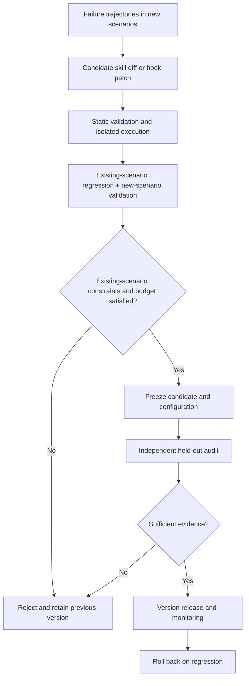

# Awesome RSI Classified — A Taxonomy of RSI and Self-Improving Agents

[中文](README.md) | **English**

> An index of Recursive Self-Improvement (RSI) and related self-improving agent methods, classified by what systems actually modify, with papers and source evidence.

This maintained taxonomy and research index maps current self-improvement approaches, representative methods, and their boundaries. Its nine modification targets cover prompts, memory, skills, workflows, hooks, agent source code, task programs, model weights, and research artifacts. Engineering and regression-evaluation guidance is supplementary reading.

Review date: 2026-10-07. Projects are organized by the objects they modify, using key source paths and original papers/official materials as classification evidence.

## Reading guide

- [Classification method and RSI scope](#taxonomy-method)
- [Coverage and review methodology](#coverage)
- [Nine modification targets and their meanings](#taxonomy)
- [Method overview and evidence status](#overview)
- [Which methods approach recursive self-improvement?](#recursive-boundary)
- [Evaluation, verification, and risk resources](#evaluations)
- [How to cite](#citation) · [Contributions and corrections](CONTRIBUTING.md)

<a id="taxonomy-method"></a>
## Classification method and RSI scope

**This index first asks what a system actually changes.** This is a lens for comparing implementation mechanisms, not a universal definition of RSI, a capability ranking, or a claim of exhaustive coverage. The nine categories are not successive levels of capability.

- **The unit of classification is a method and the inspected implementation path.** A framework may contain multiple optimizers; findings about one optimizer do not apply to the entire framework.
- **The primary modification target determines placement.** When several assets change, retain one primary category and document the others in the entry. Distinguish training-time changes from runtime changes.
- **Self-improvement does not automatically establish recursive self-improvement.** Prompt updates, skill accumulation, and task-program evolution are included as related techniques. Assessing recursion also requires checking whether the improver changes and whether the changed improver participates in later improvement. Self-modifying code alone does not demonstrate sustained capability gains.
- **Classification evidence and effectiveness evidence are separate.** Source write-back locations can support a modification-target classification, but cannot alone establish performance gains, cross-task generalization, or absence of regressions.

Feedback sources, optimization stages, weight training, and evaluation loops are additional comparison dimensions rather than the same classification axis. Consult each entry's inspection boundaries and original sources for specific conclusions.

<a id="coverage"></a>

## Coverage and review methodology

- Includes **61 method entries and 37 evaluation/background entries**, plus **22 related methods and 2 practical articles**.
- Different methods in the same repository are described separately; repository counts and method counts are distinct.
- Where an implementation could be located, key functions, edit/write-back locations, training entry points, or candidate-execution code were read at pinned commits. “Source inspection” means checking key static paths, **rather than a complete code audit or experimental reproduction**.
- Source was only downloaded/read. Projects were not installed, agents were not executed, models were not trained, and performance was not reproduced. A directory, a README claiming open source, or released model weights does not establish that complete training/search code is available.
- Entries without a confirmed author implementation retain paper-level classifications and are marked unverified. This describes the outcome of this review, rather than asserting that no code exists anywhere.
- A method can modify several objects. Each is placed in one primary group by its main deployment/optimization artifact; additional objects remain documented. Training-time and runtime changes are recorded separately.

<a id="taxonomy"></a>
## Engineering meaning of modification targets

| Category | Assets that actually change | Common stored forms | Distinctions to preserve |
| --- | --- | --- | --- |
| Prompts, instructions, and examples | Instructions, examples, text parameters | Prompts, configuration strings | Language gradients do not necessarily update LLM weights |
| Context, experience, and procedural memory | Experience rules, reflections, procedure descriptions, retrieval entries | JSON, text, vector stores | Workflow memory is not necessarily an executable workflow |
| Skill files, executable skills, and tool libraries | Skill descriptions or reusable functions/APIs | SKILL.md, Python/JS, tool schemas | Label textual and executable skills separately |
| Workflows, module composition, and graph/controller parameters | Control flow, nodes, topology, module combinations, routing parameters | graph.py, DAGs, controller checkpoints | Graph parameters are distinct from base LLM weights |
| Runtime hooks, action validation, and intervention | Intervention functions executed during lifecycle events | Python hooks, patch JSON | Generating hints is only one possible hook function |
| Agent / harness / optimizer source code | Agent, harness, or improver implementation | Git diffs, function replacements, versioned commits | Changing a task solution is distinct from modifying oneself |
| Target-task programs and algorithms | Algorithms/implementations solving the target task | Functions, scripts, compute kernels | Program evolution does not necessarily constitute recursive self-improvement |
| Model weights and updates coupled with weight training | Model weights and code/data updates coupled with weight training | Checkpoints, adapters, training data | Graph/controller parameters belong to the workflow category; identify which model is trained |
| Research artifacts, experiment code, and synthetic data | Hypotheses, experiments, papers, questions/data | Code, reports, datasets | A research loop does not necessarily rewrite the research agent |

RSI means Recursive Self-Improvement here. Prompt optimization, skill accumulation, and automatic agent design are useful references, but they do not all demonstrate a recursive loop in which the optimizer itself becomes increasingly capable.

<a id="overview"></a>
## Project overview

The Category column uses exactly the same names as the table above and the detailed section headings below. Specific modified objects describes the actual changing assets. Projects may involve several objects; the primary artifact determines the category, while other changes appear in the remaining columns and project details.

| Project | Category | Specific modified objects | Weight changes / inspection boundary | Evidence status |
| --- | --- | --- | --- | --- |
| APE | [Prompts, instructions, and examples](#prompt) | Task-instruction strings | Prompt generation and evaluation do not fine-tune the target model | Key source paths statically inspected |
| OPRO | [Prompts, instructions, and examples](#prompt) | Natural-language instruction candidates | Instruction search uses model inference rather than gradient-based LLM training | Key source paths statically inspected |
| EvoPrompt | [Prompts, instructions, and examples](#prompt) | A population of prompts | The inspected evolution loop updates a population of strings | Key source paths statically inspected |
| Promptbreeder | [Prompts, instructions, and examples](#prompt) | Task prompts and mutation prompts that modify task prompts | The inspected third-party implementation does not train the LLM | Key source paths in a third-party implementation inspected |
| ProTeGi | [Prompts, instructions, and examples](#prompt) | Task prompts | Textual gradients are language feedback rather than target LLM parameter gradients | Key source paths statically inspected |
| DSPy | [Prompts, instructions, and examples](#prompt) | Module instructions, signature instructions, and few-shot demonstrations | This inspection covers MIPROv2; DSPy also has other training-based optimizers | Key source paths statically inspected |
| MIPROv2 | [Prompts, instructions, and examples](#prompt) | Combinations of multi-module instructions and few-shot examples | The inspected version searches candidates with Bayesian optimization without training the task LLM | Key source paths statically inspected |
| TextGrad | [Prompts, instructions, and examples](#prompt) | Text Variables with requires_grad, such as prompts, answers, or code strings | Textual gradients are distinct from LLM weight gradients | Key source paths statically inspected |
| GEPA | [Prompts, instructions, and examples](#prompt) | Text components in candidate dictionaries; adapters can interpret them as prompts, skills, code, etc. | The reflective-search core does not perform gradient updates to the task LLM | Key source paths statically inspected |
| Reflexion | [Context, experience, and procedural memory](#memory) | Reflection text and episodic experience context | The inspected path uses LLM inference without training the target model | Key source paths statically inspected |
| ExpeL | [Context, experience, and procedural memory](#memory) | Experience rules, historical trajectories, and retrieved examples | The experience-learning path does not update target LLM weights | Key source paths statically inspected |
| Dynamic Cheatsheet | [Context, experience, and procedural memory](#memory) | Dynamic cheatsheet text | Test-time text-memory updates are distinct from fine-tuning | Key source paths statically inspected |
| ACE | [Context, experience, and procedural memory](#memory) | Playbook experience entries and metadata | The inspected curator uses API inference | Key source paths statically inspected |
| ReasoningBank | [Context, experience, and procedural memory](#memory) | Reasoning experience induced from successes and failures | The inspected induction path uses inference calls | Key source paths statically inspected |
| Agent Workflow Memory (AWM) | [Context, experience, and procedural memory](#memory) | Natural-language workflow memory | Induction and retrieval do not train the target LLM | Key source paths statically inspected |
| Memp | [Context, experience, and procedural memory](#memory) | Procedural-memory documents: steps, strategies, and trajectory summaries | The inspected memory path does not update target LLM weights | Key source paths statically inspected |
| AgentRxiv | [Context, experience, and procedural memory](#memory) | A shared paper repository, retrieval context, and research reports | The shared-knowledge path was inspected; it does not train agent weights | Key source paths statically inspected |
| MCE | [Skill files, executable skills, and tool libraries](#skills) | A context-engineering SKILL.md and the context files/code produced by its execution | The inspected path edits files through an external agent, without training the base model here | Key source paths statically inspected |
| Alita | [Skill files, executable skills, and tool libraries](#skills) | Dynamic MCP tool code and a reusable tool library described in the paper | Paper-level mechanism classification; implementation unconfirmed | Paper/documentation; core source unverified |
| Voyager | [Skill files, executable skills, and tool libraries](#skills) | Executable JavaScript skills, skill descriptions, and a retrieval library | The skill-accumulation path does not fine-tune the LLM | Key source paths statically inspected |
| SkillWeaver | [Skill files, executable skills, and tool libraries](#skills) | Python/API skill functions for web interaction and a knowledge base | The inspected exploration/storage path generates code through inference | Key source paths statically inspected |
| CORAL | [Skill files, executable skills, and tool libraries](#skills) | Research-attempt code, shared notes, and reusable skill directories | Inspected skill sharing does not imply LLM weight updates | Key source paths statically inspected |
| gskill | [Skill files, executable skills, and tool libraries](#skills) | Skill-description text in best_skills.txt, injectable into prompts/skill files | GEPA searches text rather than fine-tuning the target coding agent | Key source paths statically inspected |
| SkillHone | [Skill files, executable skills, and tool libraries](#skills) | Whole skill bundles and tests; additional decision history | External editor inference; no weight training in inspected paths | Key source paths statically inspected (2026-10-10) |
| ADAS / Meta Agent Search | [Workflows, module composition, and graph/controller parameters](#workflow) | Implementation code for a new agent's forward() method | The inspected Meta Agent Search uses fixed models to generate code | Key source paths statically inspected |
| AFlow | [Workflows, module composition, and graph/controller parameters](#workflow) | Workflow graph.py and node prompts | Workflow search does not fine-tune the target LLM | Key source paths statically inspected |
| GPTSwarm | [Workflows, module composition, and graph/controller parameters](#workflow) | Node prompts and edge-connection probabilities/graph parameters | Graph-structure parameters receive gradient updates; these are distinct from base LLM weights | Key source paths statically inspected |
| AgentSquare | [Workflows, module composition, and graph/controller parameters](#workflow) | Code and combinations of planning, reasoning, memory, and tool-use modules | The inspected search generates candidate modules through inference | Key source paths statically inspected |
| MaAS | [Workflows, module composition, and graph/controller parameters](#workflow) | Query-conditioned architecture-controller parameters and agentic operators | Controller/architecture-distribution parameters are trained, rather than base task LLM weights | Key source paths statically inspected |
| MASS | [Workflows, module composition, and graph/controller parameters](#workflow) | Local/global prompts and multi-agent topology | The paper describes joint search; an author implementation was not located in this review | Paper/documentation; core source unverified |
| EvoAgent | [Workflows, module composition, and graph/controller parameters](#workflow) | Agent role/function configurations, prompts, and population composition | The inspected example generates agent configurations through inference | Key source paths statically inspected |
| Agent Symbolic Learning | [Workflows, module composition, and graph/controller parameters](#workflow) | Node prompts, SOP/workflows, and symbolic toolkit configurations | Language feedback optimizes symbolic components rather than automatically training the base LLM | Key source paths statically inspected |
| AutoHarness | [Runtime hooks, action validation, and intervention](#hooks) | Environment-specific action-legality check functions or direct action-policy code | The paper concerns harness synthesis; future base-model distillation is a subsequent direction | Paper/documentation; core source unverified |
| Harness-R1 | [Runtime hooks, action validation, and intervention](#hooks) | Python lifecycle hooks | The engineer model is trained with SFT/GRPO; the target agent is frozen within the same stage | Key source paths statically inspected |
| STOP | [Agent / harness / optimizer source code](#selfcode) | Source code of the improve_algorithm optimizer itself | Recursive code improvement, with model inference weights kept external | Key source paths statically inspected |
| Gödel Agent | [Agent / harness / optimizer source code](#selfcode) | Runtime Python function, class, or module logic | The inspected self-modification path does not train the LLM | Key source paths statically inspected |
| Darwin Gödel Machine (DGM) | [Agent / harness / optimizer source code](#selfcode) | The coding agent's own source, tools, and control logic | The inspected self-improvement path changes code without base LLM training | Key source paths statically inspected |
| SICA | [Agent / harness / optimizer source code](#selfcode) | The current coding agent's codebase | The inspected loop selects agent versions and then improves/evaluates code | Key source paths statically inspected |
| Meta-Harness | [Agent / harness / optimizer source code](#selfcode) | Harness source around a fixed model: context, retrieval, execution flow, etc. | The inspected example keeps the base model fixed and searches wrapper code | Key source paths statically inspected |
| Self-Harness | [Agent / harness / optimizer source code](#selfcode) | Prompts, skills, subagents, runtime recovery, and other components exposed by repo_baseline.py | The public description keeps the model and evaluator fixed | Key source paths statically inspected |
| Hyperagents | [Agent / harness / optimizer source code](#selfcode) | Task-agent and meta-agent codebases | The inspected path edits code through model tool calls | Key source paths statically inspected |
| Ouroboros | [Agent / harness / optimizer source code](#selfcode) | Agent core source and reviewed successor versions | The inspected evolution mechanism updates code/commits | Key source paths statically inspected |
| AlphaEvolve | [Target-task programs and algorithms](#program) | Problem-solving algorithms/programs, such as mathematical constructions and compute kernels | The original method primarily searches programs; base LLM training was not confirmed here | Paper/documentation; core source unverified |
| FunSearch | [Target-task programs and algorithms](#program) | The body of a designated function to evolve | The inspected open core uses LLM sampling and program scoring | Key source paths statically inspected |
| ShinkaEvolve | [Target-task programs and algorithms](#program) | Target program code; optional evolution of mutation/system prompts | The program-evolution core is distinct from base LLM training | Key source paths statically inspected |
| ThetaEvolve | [Target-task programs and algorithms](#program) | Target programs and the program-generation policy | Includes evolution and RL-training directions; actual trained parameters depend on configuration | Key source paths statically inspected |
| ELM | [Target-task programs and algorithms](#program) | Program populations and code diffs; the paper also has a phase training models on evolved data | Separate the search implementation from subsequent training phases in the paper | Key source paths statically inspected |
| OpenEvolve | [Target-task programs and algorithms](#program) | Source of the program being optimized and its candidate population | The inspected core generates code variants through LLM calls without base LLM training | Key source paths statically inspected |
| MemAct | [Model weights and updates coupled with weight training](#weights) | A trained memory-management policy; runtime messages and working memory | Actor weights are trained; runtime actions also edit/prune context | Key source paths statically inspected |
| ScoreFlow | [Model weights and updates coupled with weight training](#weights) | Workflow-generator model weights and generated workflow code | The generator is trained with DPO; this is more than workflow search without weight updates | Key source paths statically inspected |
| FlowReasoner | [Model weights and updates coupled with weight training](#weights) | A query-level workflow-generator model and its generated workflows | The authors describe SFT and RL updates to the meta-agent; training implementation was not confirmed in the inspected key files | Runtime source inspected; training supported by documentation only |
| SIA | [Model weights and updates coupled with weight training](#weights) | Harness/target-agent code and optional RL weight-update processes | Harness and weights are separate modes; both need not change in every round | Key source paths statically inspected |
| SEAL | [Model weights and updates coupled with weight training](#weights) | Self-generated training data/update configurations and adapted model weights | The inner loop adapts the model; the outer loop learns a self-edit generation policy | Key source paths statically inspected |
| CycleResearcher | [Model weights and updates coupled with weight training](#weights) | Research-paper generator/reviewer model weights; paper text at runtime | The paper involves training; the inspected public entry point primarily loads models and runs inference | Runtime source inspected; training supported by documentation only |
| The AI Scientist-v2 | [Research artifacts, experiment code, and synthetic data](#research) | Experiment implementation code, experiment-tree nodes, results, and paper artifacts | Experiments may train the research subject, which is distinct from training the scientist agent | Key source paths statically inspected |
| Dolphin | [Research artifacts, experiment code, and synthetic data](#research) | Research ideas, experiment implementations, and feedback records | Separate experiment-model training from training the Dolphin agent itself | Key source paths statically inspected |
| NovelSeek / InternAgent | [Research artifacts, experiment code, and synthetic data](#research) | Research plans, experiment code, and historical ideas/experience | Research tasks may train models; this does not imply fine-tuning the base agent in every round | Key source paths statically inspected |
| AI co-scientist | [Research artifacts, experiment code, and synthetic data](#research) | Research hypotheses, reviews, and ranked candidates | Paper-level mechanism classification; the author's core implementation is unconfirmed | Paper/documentation; core source unverified |
| AIDE | [Research artifacts, experiment code, and synthetic data](#research) | ML experiment scripts for task solutions and a search tree | It trains the model under study, rather than the AIDE agent | Key source paths statically inspected |
| Autodata | [Research artifacts, experiment code, and synthetic data](#research) | Synthetic tasks/questions/rubrics; the outer loop can also modify the data-generation harness | Official descriptions also include downstream model training on generated data | Official materials reviewed; core implementation unverified |
| ResearchAgent | [Research artifacts, experiment code, and synthetic data](#research) | Research-problem, method, and experiment-design text | The inspected pipeline generates and reviews through model calls without LLM training | Key source paths statically inspected |

## Details by modification target

[Prompts, instructions, and examples](#prompt) · [Context, experience, and procedural memory](#memory) · [Skill files, executable skills, and tool libraries](#skills) · [Workflows, module composition, and graph/controller parameters](#workflow) · [Runtime hooks, action validation, and intervention](#hooks) · [Agent / harness / optimizer source code](#selfcode) · [Target-task programs and algorithms](#program) · [Model weights and updates coupled with weight training](#weights) · [Research artifacts, experiment code, and synthetic data](#research)

<a id="prompt"></a>

### Prompts, instructions, and examples

#### APE

[Paper / original description](https://arxiv.org/abs/2211.01910) · [Public repository](https://github.com/keirp/automatic_prompt_engineer) · [Inspected entry: automatic_prompt_engineer/ape.py](https://github.com/keirp/automatic_prompt_engineer/blob/eac521c79a78965245ce7745dcc9f6b0792c7ec7/automatic_prompt_engineer/ape.py)

- **Primary modification**: Task-instruction strings.
- **Weight boundary**: Prompt generation and evaluation do not fine-tune the target model.
- **Source / material findings**: ape.py calls generate_prompts and then evaluates candidate instructions.
- **Evidence status**: Key source paths statically inspected; no experiments were run.

#### OPRO

[Paper / original description](https://arxiv.org/abs/2309.03409) · [Public repository](https://github.com/google-deepmind/opro) · [Inspected entry: opro/optimization/optimize_instructions.py](https://github.com/google-deepmind/opro/blob/a76bdce2cbf6d4a0d1e570a6fcfe17be9c2abdd7/opro/optimization/optimize_instructions.py)

- **Primary modification**: Natural-language instruction candidates.
- **Weight boundary**: Instruction search uses model inference rather than gradient-based LLM training.
- **Source / material findings**: optimize_instructions.py configures scorer/optimizer models and instruction search. The repository also contains numerical optimization examples; this classification concerns its prompt method.
- **Evidence status**: Key source paths statically inspected; no experiments were run.

#### EvoPrompt

[Paper / original description](https://arxiv.org/abs/2309.08532) · [Public repository](https://github.com/beeevita/EvoPrompt) · [Inspected entry: evoluter.py](https://github.com/beeevita/EvoPrompt/blob/94caff336555df99acc5c338c7930c40cc550ad9/evoluter.py)

- **Primary modification**: A population of prompts.
- **Weight boundary**: The inspected evolution loop updates a population of strings.
- **Source / material findings**: evoluter.py generates new_pop and replaces or selects population members after evaluation.
- **Evidence status**: Key source paths statically inspected; no experiments were run.

#### Promptbreeder

[Paper / original description](https://arxiv.org/abs/2309.16797) · [Public repository](https://github.com/dylski/promptbreeder) · [Inspected entry: mutator.py](https://github.com/dylski/promptbreeder/blob/e707e1e71fa89c27c26728b1af44836d700214d9/mutator.py)

- **Primary modification**: Task prompts and mutation prompts that modify task prompts.
- **Weight boundary**: The inspected third-party implementation does not train the LLM.
- **Source / material findings**: mutator.py accepts current_task_prompt/current_mutation_prompt and includes hypermutation. This is a minimal third-party reproduction, rather than author code.
- **Evidence status**: Key source paths in a third-party implementation inspected; no experiments were run.

#### ProTeGi

[Paper / original description](https://arxiv.org/abs/2305.03495) · [Public repository](https://github.com/microsoft/LMOps) · [Inspected entry: prompt_optimization/optimizers.py](https://github.com/microsoft/LMOps/blob/6f53ef41c951de0962bbf27fe3f5819eabc8ce0e/prompt_optimization/optimizers.py)

- **Primary modification**: Task prompts.
- **Weight boundary**: Textual gradients are language feedback rather than target LLM parameter gradients.
- **Source / material findings**: prompt_optimization/optimizers.py expands new_prompts using error feedback; main.py searches and evaluates candidates.
- **Evidence status**: Key source paths statically inspected; no experiments were run.

#### DSPy

[Paper / original description](https://arxiv.org/abs/2310.03714) · [Public repository](https://github.com/stanfordnlp/dspy) · [Inspected entry: dspy/teleprompt/mipro_optimizer_v2.py](https://github.com/stanfordnlp/dspy/blob/bc8af7ed3d5ee0b892211e5c03274396442a413c/dspy/teleprompt/mipro_optimizer_v2.py)

- **Primary modification**: Module instructions, signature instructions, and few-shot demonstrations.
- **Weight boundary**: This inspection covers MIPROv2; DSPy also has other training-based optimizers.
- **Source / material findings**: The compiler sets predictor instructions and demos. One optimizer's behavior cannot be generalized to the entire DSPy framework.
- **Evidence status**: Key source paths statically inspected; no experiments were run.

#### MIPROv2

[Paper / original description](https://arxiv.org/abs/2406.11695) · [Public repository](https://github.com/stanfordnlp/dspy) · [Inspected entry: dspy/teleprompt/mipro_optimizer_v2.py](https://github.com/stanfordnlp/dspy/blob/bc8af7ed3d5ee0b892211e5c03274396442a413c/dspy/teleprompt/mipro_optimizer_v2.py)

- **Primary modification**: Combinations of multi-module instructions and few-shot examples.
- **Weight boundary**: The inspected version searches candidates with Bayesian optimization without training the task LLM.
- **Source / material findings**: _optimize_prompt_parameters() searches instruction/demo indices and assigns predictor.demos. It shares the DSPy repository.
- **Evidence status**: Key source paths statically inspected; no experiments were run.

#### TextGrad

[Paper / original description](https://arxiv.org/abs/2406.07496) · [Public repository](https://github.com/zou-group/textgrad) · [Inspected entry: textgrad/optimizer/optimizer.py](https://github.com/zou-group/textgrad/blob/75e912e210864b61999781778cdf756d4468120f/textgrad/optimizer/optimizer.py)

- **Primary modification**: Text Variables with requires_grad, such as prompts, answers, or code strings.
- **Weight boundary**: Textual gradients are distinct from LLM weight gradients.
- **Source / material findings**: TextualGradientDescent.step() generates new_value and calls parameter.set_value(new_value). The caller-provided Variable determines what is modified.
- **Evidence status**: Key source paths statically inspected; no experiments were run.

#### GEPA

[Paper / original description](https://arxiv.org/abs/2507.19457) · [Public repository](https://github.com/gepa-ai/gepa) · [Inspected entry: src/gepa/proposer/reflective_mutation/reflective_mutation.py](https://github.com/gepa-ai/gepa/blob/fb1ed589fd83372caef499cffc2c73173d3b096b/src/gepa/proposer/reflective_mutation/reflective_mutation.py)

- **Primary modification**: Text components in candidate dictionaries; adapters can interpret them as prompts, skills, code, etc..
- **Weight boundary**: The reflective-search core does not perform gradient updates to the task LLM.
- **Source / material findings**: ReflectiveMutationProposer builds reflection data and calls propose_new_texts or a custom proposer. The adapter defines the actual editable objects.
- **Evidence status**: Key source paths statically inspected; no experiments were run.

<a id="memory"></a>

### Context, experience, and procedural memory

#### Reflexion

[Paper / original description](https://arxiv.org/abs/2303.11366) · [Public repository](https://github.com/noahshinn/reflexion) · [Inspected entry: hotpotqa_runs/agents.py](https://github.com/noahshinn/reflexion/blob/218cf0ef1df84b05ce379dd4a8e47f17766733a0/hotpotqa_runs/agents.py)

- **Primary modification**: Reflection text and episodic experience context.
- **Weight boundary**: The inspected path uses LLM inference without training the target model.
- **Source / material findings**: reflect() updates reflections and inserts reflections_str into the next prompt.
- **Evidence status**: Key source paths statically inspected; no experiments were run.

#### ExpeL

[Paper / original description](https://arxiv.org/abs/2308.10144) · [Public repository](https://github.com/LeapLabTHU/ExpeL) · [Inspected entry: agent/expel.py](https://github.com/LeapLabTHU/ExpeL/blob/e41ec9a24823e7b560c561ab191441b56d9bcefc/agent/expel.py)

- **Primary modification**: Experience rules, historical trajectories, and retrieved examples.
- **Weight boundary**: The experience-learning path does not update target LLM weights.
- **Source / material findings**: ExpelAgent stores successful and failed trajectories; rule-processing functions add/remove rules and filter them by counts.
- **Evidence status**: Key source paths statically inspected; no experiments were run.

#### Dynamic Cheatsheet

[Paper / original description](https://arxiv.org/abs/2504.07952) · [Public repository](https://github.com/suzgunmirac/dynamic-cheatsheet) · [Inspected entry: dynamic_cheatsheet/language_model.py](https://github.com/suzgunmirac/dynamic-cheatsheet/blob/5cfe3c37e8e52b1d858d0f3df46e7f17c50991b9/dynamic_cheatsheet/language_model.py)

- **Primary modification**: Dynamic cheatsheet text.
- **Weight boundary**: Test-time text-memory updates are distinct from fine-tuning.
- **Source / material findings**: language_model.py generates new_cheatsheet and supplies it as previous cheatsheet in the next round.
- **Evidence status**: Key source paths statically inspected; no experiments were run.

#### ACE

[Paper / original description](https://arxiv.org/abs/2510.04618) · [Public repository](https://github.com/ace-agent/ace) · [Inspected entry: ace/core/curator.py](https://github.com/ace-agent/ace/blob/82709de050e1db6e6ef2f07bcb0393560b94992a/ace/core/curator.py)

- **Primary modification**: Playbook experience entries and metadata.
- **Weight boundary**: The inspected curator uses API inference.
- **Source / material findings**: curator.py generates structured operations. Comments in the inspected version state that ADD is more fully supported; other operations may be incomplete. Do not assume every operation described in the paper is fully implemented.
- **Evidence status**: Key source paths statically inspected; no experiments were run.

#### ReasoningBank

[Paper / original description](https://arxiv.org/abs/2509.25140) · [Public repository](https://github.com/google-research/reasoning-bank) · [Inspected entry: WebArena/induce_memory.py](https://github.com/google-research/reasoning-bank/blob/ed80611788292ea739f1effd31f16c53823b8a0d/WebArena/induce_memory.py)

- **Primary modification**: Reasoning experience induced from successes and failures.
- **Weight boundary**: The inspected induction path uses inference calls.
- **Source / material findings**: induce_memory.py selects different prompts for successful/failed cases and generates memory items; memory_management.py handles retrieval.
- **Evidence status**: Key source paths statically inspected; no experiments were run.

#### Agent Workflow Memory (AWM)

[Paper / original description](https://arxiv.org/abs/2409.07429) · [Public repository](https://github.com/zorazrw/agent-workflow-memory) · [Inspected entry: mind2web/online_induction.py](https://github.com/zorazrw/agent-workflow-memory/blob/8c0ff8cd11d648c8fceb99e4e42f37e3b75381b1/mind2web/online_induction.py)

- **Primary modification**: Natural-language workflow memory.
- **Weight boundary**: Induction and retrieval do not train the target LLM.
- **Source / material findings**: online_induction.py induces workflows from experience and writes them to files. Here, workflow means memory content, rather than rewritten execution-graph source code.
- **Evidence status**: Key source paths statically inspected; no experiments were run.

#### Memp

[Paper / original description](https://arxiv.org/abs/2508.06433) · [Public repository](https://github.com/zjunlp/MemP) · [Inspected entry: ProcedureMem/memory.py](https://github.com/zjunlp/MemP/blob/3066a1b280a39c7433ae37d9a745861903a5d3c4/ProcedureMem/memory.py)

- **Primary modification**: Procedural-memory documents: steps, strategies, and trajectory summaries.
- **Weight boundary**: The inspected memory path does not update target LLM weights.
- **Source / material findings**: ProcedureMem/memory.py provides build/retrieve/update operations and deletes, adds, and saves documents. A script-like procedure description should not automatically be classified as an executable skill.
- **Evidence status**: Key source paths statically inspected; no experiments were run.

#### AgentRxiv

[Paper / original description](https://arxiv.org/abs/2503.18102) · [Public repository](https://github.com/SamuelSchmidgall/AgentLaboratory) · [Inspected entry: ai_lab_repo.py](https://github.com/SamuelSchmidgall/AgentLaboratory/blob/d9017d90e329112d2a80b7712f37ee9094d2cd27/ai_lab_repo.py)

- **Primary modification**: A shared paper repository, retrieval context, and research reports.
- **Weight boundary**: The shared-knowledge path was inspected; it does not train agent weights.
- **Source / material findings**: The official site's Code link points to AgentLaboratory. The AgentRxiv class in ai_lab_repo.py searches shared reports and writes research PDFs into uploads.
- **Evidence status**: Key source paths statically inspected; no experiments were run.

<a id="skills"></a>

### Skill files, executable skills, and tool libraries

#### MCE

[Paper / original description](https://arxiv.org/abs/2601.21557) · [Public repository](https://github.com/metaevo-ai/meta-context-engineering) · [Inspected entry: mce/meta_agent.py](https://github.com/metaevo-ai/meta-context-engineering/blob/c4b7a7c2ce3ffc4bf4a74c52d2dd8a9a8fb14c30/mce/meta_agent.py) · [Additional source: mce/base_agent.py](https://github.com/metaevo-ai/meta-context-engineering/blob/c4b7a7c2ce3ffc4bf4a74c52d2dd8a9a8fb14c30/mce/base_agent.py)

- **Primary modification**: A context-engineering SKILL.md and the context files/code produced by its execution.
- **Weight boundary**: The inspected path edits files through an external agent, without training the base model here.
- **Source / material findings**: meta_agent.py validates .claude/skills/learning-context/SKILL.md; base_agent.py authorizes reading/writing context artifacts in the iteration directory.
- **Evidence status**: Key source paths statically inspected; no experiments were run.

#### Alita

[Paper / original description](https://arxiv.org/abs/2505.20286) · [Public repository](https://github.com/CharlesQ9/Alita)

- **Primary modification**: Dynamic MCP tool code and a reusable tool library described in the paper.
- **Weight boundary**: Paper-level mechanism classification; implementation unconfirmed.
- **Source / material findings**: The inspected fixed commit in CharlesQ9/Alita contains only a README and images, without core source. A planned release described in a README should not be treated as already released.
- **Evidence status**: Paper/documentation; core source unverified; no experiments were run.

#### Voyager

[Paper / original description](https://arxiv.org/abs/2305.16291) · [Public repository](https://github.com/MineDojo/Voyager) · [Inspected entry: voyager/agents/skill.py](https://github.com/MineDojo/Voyager/blob/55e45a880755d0c8c66ca7fb5fe7962ac8974f89/voyager/agents/skill.py)

- **Primary modification**: Executable JavaScript skills, skill descriptions, and a retrieval library.
- **Weight boundary**: The skill-accumulation path does not fine-tune the LLM.
- **Source / material findings**: SkillManager.add_new_skill() saves code/description and inserts descriptions into a vector store; retrieve_skills() returns code.
- **Evidence status**: Key source paths statically inspected; no experiments were run.

#### SkillWeaver

[Paper / original description](https://arxiv.org/abs/2504.07079) · [Public repository](https://github.com/OSU-NLP-Group/SkillWeaver) · [Inspected entry: skillweaver/knowledge_base/knowledge_base.py](https://github.com/OSU-NLP-Group/SkillWeaver/blob/f2a63d65d0f6ff46ac30e817cede8797f8f25b97/skillweaver/knowledge_base/knowledge_base.py)

- **Primary modification**: Python/API skill functions for web interaction and a knowledge base.
- **Weight boundary**: The inspected exploration/storage path generates code through inference.
- **Source / material findings**: knowledge_base.py maintains functions, schemas, and skill code; explore.py organizes exploration. Adding and validating functions is distinct from plain text memory.
- **Evidence status**: Key source paths statically inspected; no experiments were run.

#### CORAL

[Paper / original description](https://arxiv.org/abs/2604.01658) · [Public repository](https://github.com/Human-Agent-Society/CORAL) · [Inspected entry: coral/hub/skills.py](https://github.com/Human-Agent-Society/CORAL/blob/0123dfb939b35228cf2c1fde224cd0561e727408/coral/hub/skills.py)

- **Primary modification**: Research-attempt code, shared notes, and reusable skill directories.
- **Weight boundary**: Inspected skill sharing does not imply LLM weight updates.
- **Source / material findings**: coral/hub/skills.py reads skill directories/files; task programs are also a major evolution target. Skill-sharing support alone does not demonstrate automatic rewriting of the optimizer.
- **Evidence status**: Key source paths statically inspected; no experiments were run.

#### gskill

[Paper / original description](https://gepa-ai.github.io/gepa/guides/gskill/) · [Public repository](https://github.com/gepa-ai/gepa) · [Inspected entry: src/gepa/gskill/gskill/train_optimize_anything.py](https://github.com/gepa-ai/gepa/blob/fb1ed589fd83372caef499cffc2c73173d3b096b/src/gepa/gskill/gskill/train_optimize_anything.py)

- **Primary modification**: Skill-description text in best_skills.txt, injectable into prompts/skill files.
- **Weight boundary**: GEPA searches text rather than fine-tuning the target coding agent.
- **Source / material findings**: The proposer in train_optimize_anything.py receives curr_skills and execution feedback and produces new skill candidates. It shares the GEPA source repository.
- **Evidence status**: Key source paths statically inspected; no experiments were run.

#### SkillHone

[Paper](https://arxiv.org/abs/2606.08671) · [Author repository](https://github.com/Tencent/SkillHone)

- **Primary modification**: Whole skill bundles: `SKILL.md`, scripts, references, and tests; local Issue/PR/Wiki decision records are additional memory. The primary target is skills, not the harness's own source.
- **Weight boundary**: Inspected revision paths invoke external DeepSeek Harness inference and file editing; no target-model or editor-model weight training was found there.
- **Source findings**: `runIsolatedBenchmarkRepair` creates commits in a temporary clone and fetches the candidate branch back. `evaluateCandidate` compares probe and optional `pr_val` scores. Runtime repair reruns Issue-linked tests before creating a local PR. Decision records retain prior choices; a saved policy controls local merging.
- **Generalization and regression limits**: The paper reports results across research tasks; we did not reproduce them. Benchmark selection permits a **0.02** aggregate `pr_val` score drop from baseline; without that baseline, this check is absent. It does not enforce zero regressions per old task. Runtime repair checks linked tests only; an empty test list can pass.
- **Dates and inspection**: Paper submitted 2026-06-07, v3 dated 2026-07-06. September code updates cover runtime feedback and auditing; the pinned revision's latest commit is dated 2026-09-20. Author implementation statically inspected on 2026-10-10; no project execution or experiments. This is not a newly published paper today.

Pinned source: [src/core/benchmark.ts](https://github.com/Tencent/SkillHone/blob/c613aa99193079383c7a3ad81df1df005685e6af/src/core/benchmark.ts) · [src/core/harness.ts](https://github.com/Tencent/SkillHone/blob/c613aa99193079383c7a3ad81df1df005685e6af/src/core/harness.ts) · [src/cli.ts](https://github.com/Tencent/SkillHone/blob/c613aa99193079383c7a3ad81df1df005685e6af/src/cli.ts) · [src/core/tracker.ts](https://github.com/Tencent/SkillHone/blob/c613aa99193079383c7a3ad81df1df005685e6af/src/core/tracker.ts)

<a id="workflow"></a>

### Workflows, module composition, and graph/controller parameters

#### ADAS / Meta Agent Search

[Paper / original description](https://arxiv.org/abs/2408.08435) · [Public repository](https://github.com/ShengranHu/ADAS) · [Inspected entry: _mgsm/search.py](https://github.com/ShengranHu/ADAS/blob/2702bee8fefda42255efc5be9f60e3bd3db96ae4/_mgsm/search.py)

- **Primary modification**: Implementation code for a new agent's forward() method.
- **Weight boundary**: The inspected Meta Agent Search uses fixed models to generate code.
- **Source / material findings**: search.py compiles generated forward_str and attaches the function to AgentSystem.forward for evaluation. Searching agent designs alone does not demonstrate recursive improvement of the optimizer itself.
- **Evidence status**: Key source paths statically inspected; no experiments were run.

#### AFlow

[Paper / original description](https://arxiv.org/abs/2410.10762) · [Public repository](https://github.com/FoundationAgents/AFlow) · [Inspected entry: scripts/optimizer.py](https://github.com/FoundationAgents/AFlow/blob/3f457218fc716093fe53f6df8a5d5e6379d66346/scripts/optimizer.py)

- **Primary modification**: Workflow graph.py and node prompts.
- **Weight boundary**: Workflow search does not fine-tune the target LLM.
- **Source / material findings**: optimizer.py generates, loads, and evaluates graphs across rounds. The README warns that some Operators may have issues after migration to the standalone repository.
- **Evidence status**: Key source paths statically inspected; no experiments were run.

#### GPTSwarm

[Paper / original description](https://arxiv.org/abs/2402.16823) · [Public repository](https://github.com/metauto-ai/gptswarm) · [Inspected entry: swarm/optimizer/edge_optimizer/optimization.py](https://github.com/metauto-ai/gptswarm/blob/c23a827f561c934ce21dd950408f7606aa4a8821/swarm/optimizer/edge_optimizer/optimization.py)

- **Primary modification**: Node prompts and edge-connection probabilities/graph parameters.
- **Weight boundary**: Graph-structure parameters receive gradient updates; these are distinct from base LLM weights.
- **Source / material findings**: edge_optimizer/optimization.py applies loss.backward()/optimizer.step() to connection distributions; node_optimizer includes prompt optimization.
- **Evidence status**: Key source paths statically inspected; no experiments were run.

#### AgentSquare

[Paper / original description](https://arxiv.org/abs/2410.06153) · [Public repository](https://github.com/tsinghua-fib-lab/AgentSquare) · [Inspected entry: search/module_evolution.py](https://github.com/tsinghua-fib-lab/AgentSquare/blob/8f5b3fe5d8a32f9b59d20370823bef2a2c86928c/search/module_evolution.py)

- **Primary modification**: Code and combinations of planning, reasoning, memory, and tool-use modules.
- **Weight boundary**: The inspected search generates candidate modules through inference.
- **Source / material findings**: module_evolution.py generates four module types and replaces module names in agent combinations. Changing a tool-use module does not necessarily rewrite actual external tool implementations.
- **Evidence status**: Key source paths statically inspected; no experiments were run.

#### MaAS

[Paper / original description](https://arxiv.org/abs/2502.04180) · [Public repository](https://github.com/bingreeky/MaAS) · [Inspected entry: maas/ext/maas/models/controller.py](https://github.com/bingreeky/MaAS/blob/987f3c1bc9a96e844fe090db3791446e3ef0f5c7/maas/ext/maas/models/controller.py)

- **Primary modification**: Query-conditioned architecture-controller parameters and agentic operators.
- **Weight boundary**: Controller/architecture-distribution parameters are trained, rather than base task LLM weights.
- **Source / material findings**: models/controller.py contains trainable Linear encoders; optimizer.py uses the controller and optimizer to sample and evaluate subnetworks.
- **Evidence status**: Key source paths statically inspected; no experiments were run.

#### MASS

[Paper / original description](https://arxiv.org/abs/2502.02533)

- **Primary modification**: Local/global prompts and multi-agent topology.
- **Weight boundary**: The paper describes joint search; an author implementation was not located in this review.
- **Source / material findings**: The original paper describes staged optimization of prompts and topology. This is a paper-level classification, without a source-verification claim.
- **Evidence status**: Paper/documentation; core source unverified; no experiments were run.

#### EvoAgent

[Paper / original description](https://arxiv.org/abs/2406.14228) · [Public repository](https://github.com/siyuyuan/EvoAgent) · [Inspected entry: spp/agent_prompt_logic.py](https://github.com/siyuyuan/EvoAgent/blob/fc6d087b119df69466c2372cfcaf588c040aaba8/spp/agent_prompt_logic.py) · [Additional source: spp/llm_evoagent.py](https://github.com/siyuyuan/EvoAgent/blob/fc6d087b119df69466c2372cfcaf588c040aaba8/spp/llm_evoagent.py)

- **Primary modification**: Agent role/function configurations, prompts, and population composition.
- **Weight boundary**: The inspected example generates agent configurations through inference.
- **Source / material findings**: The meta template in agent_prompt_logic.py generates expert role descriptions; the check template chooses Retain/Discard based on contribution and uniqueness; the multi template injects the description into the expert prompt. llm_evoagent.py orchestrates calls. This does not update each agent's base-model weights.
- **Evidence status**: Key source paths statically inspected; no experiments were run.

#### Agent Symbolic Learning

[Paper / original description](https://arxiv.org/abs/2406.18532) · [Public repository](https://github.com/aiwaves-cn/agents) · [Inspected entry: src/agents/optimization/sop_optimizer.py](https://github.com/aiwaves-cn/agents/blob/e8c4e3c2d19739d3dff59e577d1c97090cc15f59/src/agents/optimization/sop_optimizer.py)

- **Primary modification**: Node prompts, SOP/workflows, and symbolic toolkit configurations.
- **Weight boundary**: Language feedback optimizes symbolic components rather than automatically training the base LLM.
- **Source / material findings**: The optimization directory contains prompt_optimizer, sop_optimizer, and toolkit_optimizer. Prompt/SOP entry points were inspected; the presence of a tool-optimization interface does not prove tool source code changes in every setting.
- **Evidence status**: Key source paths statically inspected; no experiments were run.

<a id="hooks"></a>

### Runtime hooks, action validation, and intervention

#### AutoHarness

[Paper / original description](https://arxiv.org/abs/2603.03329)

- **Primary modification**: Environment-specific action-legality check functions or direct action-policy code.
- **Weight boundary**: The paper concerns harness synthesis; future base-model distillation is a subsequent direction.
- **Source / material findings**: The original paper 2603.03329 includes function signatures and code examples. A complete author repository was not located. Do not conflate it with same-name projects such as aiming-lab AutoHarness.
- **Evidence status**: Paper/documentation; core source unverified; no experiments were run.

#### Harness-R1

[Paper / original description](https://arxiv.org/abs/2608.02276) · [Public repository](https://github.com/DeepExperience/Harness-R1) · [Inspected entry: code/life-harness/AgentBench/scripts/harness_r1_patch.py](https://github.com/DeepExperience/Harness-R1/blob/94f2e087f573e1b82fc9568bb634d4ae9a887e28/code/life-harness/AgentBench/scripts/harness_r1_patch.py) · [Additional source: scripts/train_engineer_sft.sh](https://github.com/DeepExperience/Harness-R1/blob/94f2e087f573e1b82fc9568bb634d4ae9a887e28/scripts/train_engineer_sft.sh) · [Additional source: scripts/train_engineer_rl.sh](https://github.com/DeepExperience/Harness-R1/blob/94f2e087f573e1b82fc9568bb634d4ae9a887e28/scripts/train_engineer_rl.sh)

- **Primary modification**: Python lifecycle hooks.
- **Weight boundary**: The engineer model is trained with SFT/GRPO; the target agent is frozen within the same stage.
- **Source / material findings**: harness_r1_patch.py restricts edits to add_code_hook. CODE_HOOKS contains on_init/make_pre_hint/on_before_action/on_post_step; code_runner.py validates execution.
- **Evidence status**: Key source paths statically inspected; no experiments were run.

<a id="selfcode"></a>

### Agent / harness / optimizer source code

#### STOP

[Paper / original description](https://arxiv.org/abs/2310.02304) · [Public repository](https://github.com/microsoft/stop) · [Inspected entry: run_improver.py](https://github.com/microsoft/stop/blob/0d6780c54306b2486dd36e9c4ae9b49aceb27ea4/run_improver.py)

- **Primary modification**: Source code of the improve_algorithm optimizer itself.
- **Weight boundary**: Recursive code improvement, with model inference weights kept external.
- **Source / material findings**: run_improver.py writes new algorithm source into versioned files and reloads it as the next improve_algorithm. The distinguishing feature is that the optimizer becomes the optimization target.
- **Evidence status**: Key source paths statically inspected; no experiments were run.

#### Gödel Agent

[Paper / original description](https://arxiv.org/abs/2410.04444) · [Public repository](https://github.com/Arvid-pku/Godel_Agent) · [Inspected entry: src/agent_module.py](https://github.com/Arvid-pku/Godel_Agent/blob/bbb508796be31c7140cdfc7106efd830a1324242/src/agent_module.py)

- **Primary modification**: Runtime Python function, class, or module logic.
- **Weight boundary**: The inspected self-modification path does not train the LLM.
- **Source / material findings**: action_adjust_logic() compiles/executes new_code and adds, removes, or replaces runtime logic. This is monkey-patching with a broader editing surface than fixed hooks.
- **Evidence status**: Key source paths statically inspected; no experiments were run.

#### Darwin Gödel Machine (DGM)

[Paper / original description](https://arxiv.org/abs/2505.22954) · [Public repository](https://github.com/jennyzzt/dgm) · [Inspected entry: self_improve_step.py](https://github.com/jennyzzt/dgm/blob/a565fd2d1dca504ef5104a7cc0f3bdc4ab9b4fd2/self_improve_step.py)

- **Primary modification**: The coding agent's own source, tools, and control logic.
- **Weight boundary**: The inspected self-improvement path changes code without base LLM training.
- **Source / material findings**: self_improve_step.py diagnoses issues, generates patches, and reruns coding benchmarks; DGM_outer.py manages the candidate archive.
- **Evidence status**: Key source paths statically inspected; no experiments were run.

#### SICA

[Paper / original description](https://arxiv.org/abs/2504.15228) · [Public repository](https://github.com/MaximeRobeyns/self_improving_coding_agent) · [Inspected entry: runner.py](https://github.com/MaximeRobeyns/self_improving_coding_agent/blob/ed8275dca4d3c5dbf77229964351fe9b424797dc/runner.py)

- **Primary modification**: The current coding agent's codebase.
- **Weight boundary**: The inspected loop selects agent versions and then improves/evaluates code.
- **Source / material findings**: runner.py selects a base version, starts containers, archives results, and runs benchmarks. The modification target is the agent implementation, rather than only an individual task answer.
- **Evidence status**: Key source paths statically inspected; no experiments were run.

#### Meta-Harness

[Paper / original description](https://arxiv.org/abs/2603.28052) · [Public repository](https://github.com/stanford-iris-lab/meta-harness) · [Inspected entry: reference_examples/terminal_bench_2/meta_harness.py](https://github.com/stanford-iris-lab/meta-harness/blob/8123ccabe2b19fa1123090b2e5f1bacc20963ce8/reference_examples/terminal_bench_2/meta_harness.py)

- **Primary modification**: Harness source around a fixed model: context, retrieval, execution flow, etc..
- **Weight boundary**: The inspected example keeps the base model fixed and searches wrapper code.
- **Source / material findings**: meta_harness.py invokes a proposer to generate candidate import paths, validates them, and evaluates them. This is harness-code search; the word meta in the name alone does not imply recursive modification of optimizer source.
- **Evidence status**: Key source paths statically inspected; no experiments were run.

#### Self-Harness

[Paper / original description](https://arxiv.org/abs/2606.09498) · [Public repository](https://github.com/qzzqzzb/Self-Harness) · [Inspected entry: workflow/scripts/run_self_harness_loop.py](https://github.com/qzzqzzb/Self-Harness/blob/2720dbb3f52283684f4b85a1065d642df1779dd8/workflow/scripts/run_self_harness_loop.py)

- **Primary modification**: Prompts, skills, subagents, runtime recovery, and other components exposed by repo_baseline.py.
- **Weight boundary**: The public description keeps the model and evaluator fixed.
- **Source / material findings**: repo_baseline.py exposes build_system_prompt/build_skills entry points; run_self_harness_loop.py manages candidates, regression checks, and acceptance. These entry points were inspected, without reproducing the full automatic proposal process.
- **Evidence status**: Key source paths statically inspected; no experiments were run.

#### Hyperagents

[Paper / original description](https://arxiv.org/abs/2603.19461) · [Public repository](https://github.com/facebookresearch/Hyperagents) · [Inspected entry: meta_agent.py](https://github.com/facebookresearch/Hyperagents/blob/59a68f672dfb92c74aeb7e61535d776fb36e172d/meta_agent.py)

- **Primary modification**: Task-agent and meta-agent codebases.
- **Weight boundary**: The inspected path edits code through model tool calls.
- **Source / material findings**: MetaAgent.forward() explicitly instructs the agent to modify any code in repo_path, allowing the meta-agent itself to become a modification target.
- **Evidence status**: Key source paths statically inspected; no experiments were run.

#### Ouroboros

[Paper / original description](https://arxiv.org/abs/2608.08311) · [Public repository](https://github.com/razzant/ouroboros) · [Inspected entry: ouroboros/tools/git_evolution.py](https://github.com/razzant/ouroboros/blob/4b37f96223b4b8248eea80c9be22cf923759cd5a/ouroboros/tools/git_evolution.py)

- **Primary modification**: Agent core source and reviewed successor versions.
- **Weight boundary**: The inspected evolution mechanism updates code/commits.
- **Source / material findings**: post_task_evolution.py and tools/git_evolution.py manage evolution and reviewed-commit permission boundaries. The Web UI's evolution.js should not be mistaken for the core self-improvement implementation.
- **Evidence status**: Key source paths statically inspected; no experiments were run.

<a id="program"></a>

### Target-task programs and algorithms

#### AlphaEvolve

[Paper / original description](https://arxiv.org/abs/2506.13131)

- **Primary modification**: Problem-solving algorithms/programs, such as mathematical constructions and compute kernels.
- **Weight boundary**: The original method primarily searches programs; base LLM training was not confirmed here.
- **Source / material findings**: A complete official AlphaEvolve core implementation was not located. Public results/examples are distinct from a complete search system. OpenEvolve is listed separately as a third-party implementation.
- **Evidence status**: Paper/documentation; core source unverified; no experiments were run.

#### FunSearch

[Paper / original description](https://www.nature.com/articles/s41586-023-06924-6) · [Public repository](https://github.com/google-deepmind/funsearch) · [Inspected entry: implementation/sampler.py](https://github.com/google-deepmind/funsearch/blob/cc53f274237d7ab05c19df939edbc1f9616a7c19/implementation/sampler.py)

- **Primary modification**: The body of a designated function to evolve.
- **Weight boundary**: The inspected open core uses LLM sampling and program scoring.
- **Source / material findings**: sampler.py generates function candidates, evaluator.py scores them, and programs_database.py stores the population. Release of the core does not automatically include all models and resources used in the paper.
- **Evidence status**: Key source paths statically inspected; no experiments were run.

#### ShinkaEvolve

[Paper / original description](https://arxiv.org/abs/2509.19349) · [Public repository](https://github.com/SakanaAI/ShinkaEvolve) · [Inspected entry: shinka/core/async_runner.py](https://github.com/SakanaAI/ShinkaEvolve/blob/8adc053a2ce4511ad2ac310e004c530a73fb974a/shinka/core/async_runner.py)

- **Primary modification**: Target program code; optional evolution of mutation/system prompts.
- **Weight boundary**: The program-evolution core is distinct from base LLM training.
- **Source / material findings**: async_runner.py manages program variants; prompt_evolver.py separately evolves system prompts. The inspected version supports more modification targets than program code alone.
- **Evidence status**: Key source paths statically inspected; no experiments were run.

#### ThetaEvolve

[Paper / original description](https://arxiv.org/abs/2511.23473) · [Public repository](https://github.com/ypwang61/ThetaEvolve) · [Inspected entry: openevolve_adapted/openevolve/controller.py](https://github.com/ypwang61/ThetaEvolve/blob/7c12898f5d7627af403e3aca643af76199fb5c20/openevolve_adapted/openevolve/controller.py)

- **Primary modification**: Target programs and the program-generation policy.
- **Weight boundary**: Includes evolution and RL-training directions; actual trained parameters depend on configuration.
- **Source / material findings**: The controller/runtime entry points in openevolve_adapted and run.sh were inspected; the source includes training scripts. It should not be described as having permanently frozen weights.
- **Evidence status**: Key source paths statically inspected; no experiments were run.

#### ELM

[Paper / original description](https://arxiv.org/abs/2206.08896) · [Public repository](https://github.com/CarperAI/OpenELM) · [Inspected entry: src/openelm/mutation_model.py](https://github.com/CarperAI/OpenELM/blob/c844e149e3f59fef546e0bc55f4e12e0f192feb9/src/openelm/mutation_model.py)

- **Primary modification**: Program populations and code diffs; the paper also has a phase training models on evolved data.
- **Weight boundary**: Separate the search implementation from subsequent training phases in the paper.
- **Source / material findings**: OpenELM's mutation_model.py generates code and applies diffs. This is a public library implementation, rather than evidence that all original-paper training experiments have been reproduced.
- **Evidence status**: Key source paths statically inspected; no experiments were run.

#### OpenEvolve

[Paper / original description](https://github.com/algorithmicsuperintelligence/openevolve) · [Public repository](https://github.com/algorithmicsuperintelligence/openevolve) · [Inspected entry: openevolve/controller.py](https://github.com/algorithmicsuperintelligence/openevolve/blob/9196d8763300d1e46cc8b48cb0dc987966db3d48/openevolve/controller.py)

- **Primary modification**: Source of the program being optimized and its candidate population.
- **Weight boundary**: The inspected core generates code variants through LLM calls without base LLM training.
- **Source / material findings**: openevolve/controller.py manages evolution, evaluation, checkpoints, and best_program.code. This is a third-party AlphaEvolve-style framework rather than DeepMind's original implementation.
- **Evidence status**: Key source paths statically inspected; no experiments were run.

<a id="weights"></a>

### Model weights and updates coupled with weight training

#### MemAct

[Paper / original description](https://arxiv.org/abs/2510.12635) · [Public repository](https://github.com/ADaM-BJTU/MemAct) · [Inspected entry: verl/experimental/agent_loop/mem_agent_loop.py](https://github.com/ADaM-BJTU/MemAct/blob/eba053e0d02e779b658a2db110d8697f157022c1/verl/experimental/agent_loop/mem_agent_loop.py) · [Additional source: verl/trainer/main_ppo.py](https://github.com/ADaM-BJTU/MemAct/blob/eba053e0d02e779b658a2db110d8697f157022c1/verl/trainer/main_ppo.py)

- **Primary modification**: A trained memory-management policy; runtime messages and working memory.
- **Weight boundary**: Actor weights are trained; runtime actions also edit/prune context.
- **Source / material findings**: mem_agent_loop.py executes memory actions such as deleting messages; main_ppo.py constructs RayPPOTrainer and calls fit().
- **Evidence status**: Key source paths statically inspected; no experiments were run.

#### ScoreFlow

[Paper / original description](https://arxiv.org/abs/2502.04306) · [Public repository](https://github.com/Gen-Verse/ScoreFlow) · [Inspected entry: ScoreFlow/DPOtrainer.py](https://github.com/Gen-Verse/ScoreFlow/blob/2492563838f75d00c6830b6c5373fa3a81b2dbc8/ScoreFlow/DPOtrainer.py)

- **Primary modification**: Workflow-generator model weights and generated workflow code.
- **Weight boundary**: The generator is trained with DPO; this is more than workflow search without weight updates.
- **Source / material findings**: ScoreFlow/DPOtrainer.py defines DPOTrainer; generate.py generates workflows. Distinguish the workflow-generator model from the models executing the workflow.
- **Evidence status**: Key source paths statically inspected; no experiments were run.

#### FlowReasoner

[Paper / original description](https://arxiv.org/abs/2504.15257) · [Public repository](https://github.com/sail-sg/FlowReasoner) · [Inspected entry: code/metagpt/ext/aflow/scripts/optimizer.py](https://github.com/sail-sg/FlowReasoner/blob/e22572e0f8997ff93f8421529fe6a01a4dfb8286/code/metagpt/ext/aflow/scripts/optimizer.py)

- **Primary modification**: A query-level workflow-generator model and its generated workflows.
- **Weight boundary**: The authors describe SFT and RL updates to the meta-agent; training implementation was not confirmed in the inspected key files.
- **Source / material findings**: The inspected optimizer.py generates/evaluates graphs. The README's Training Stage points to LLaMA-Factory/EasyRL. Runtime code is present; complete training reproducibility remains unverified.
- **Evidence status**: Runtime source inspected; training supported by documentation only; no experiments were run.

#### SIA

[Paper / original description](https://arxiv.org/abs/2605.27276) · [Public repository](https://github.com/hexo-ai/sia) · [Inspected entry: sia/orchestrator.py](https://github.com/hexo-ai/sia/blob/7fd04d07bd2f47a110115674432b73622ebf7455/sia/orchestrator.py)

- **Primary modification**: Harness/target-agent code and optional RL weight-update processes.
- **Weight boundary**: Harness and weights are separate modes; both need not change in every round.
- **Source / material findings**: sia/orchestrator.py selects harness/code or weights/RL mode according to focus; the weights path requires Tinker. Distinguish optimization-target weights from calls to an engineer model.
- **Evidence status**: Key source paths statically inspected; no experiments were run.

#### SEAL

[Paper / original description](https://arxiv.org/abs/2506.10943) · [Public repository](https://github.com/Continual-Intelligence/SEAL) · [Inspected entry: general-knowledge/src/EM/train_SFT.py](https://github.com/Continual-Intelligence/SEAL/blob/6d9c9f9ee392c6cc618e771f399d436d190f6ca4/general-knowledge/src/EM/train_SFT.py)

- **Primary modification**: Self-generated training data/update configurations and adapted model weights.
- **Weight boundary**: The inner loop adapts the model; the outer loop learns a self-edit generation policy.
- **Source / material findings**: few-shot/self-edit.py constructs test-time training data; general-knowledge/src/EM/train_SFT.py constructs SFTTrainer and calls train(). This goes beyond prompt editing.
- **Evidence status**: Key source paths statically inspected; no experiments were run.

#### CycleResearcher

[Paper / original description](https://arxiv.org/abs/2411.00816) · [Public repository](https://github.com/zhu-minjun/Researcher) · [Inspected entry: ai_researcher/cycle_researcher.py](https://github.com/zhu-minjun/Researcher/blob/8c1b253092f3f41b3efc414fb189004855bb49f8/ai_researcher/cycle_researcher.py)

- **Primary modification**: Research-paper generator/reviewer model weights; paper text at runtime.
- **Weight boundary**: The paper involves training; the inspected public entry point primarily loads models and runs inference.
- **Source / material findings**: cycle_researcher.py is a paper-generation inference interface. Complete iterative RL-training source was not confirmed. Code/weights use a custom license and should not automatically be treated as MIT-style open source.
- **Evidence status**: Runtime source inspected; training supported by documentation only; no experiments were run.

<a id="research"></a>

### Research artifacts, experiment code, and synthetic data

#### The AI Scientist-v2

[Paper / original description](https://arxiv.org/abs/2504.08066) · [Public repository](https://github.com/SakanaAI/AI-Scientist-v2) · [Inspected entry: ai_scientist/treesearch/agent_manager.py](https://github.com/SakanaAI/AI-Scientist-v2/blob/96bd51617cfdbb494a9fc283af00fe090edfae48/ai_scientist/treesearch/agent_manager.py)

- **Primary modification**: Experiment implementation code, experiment-tree nodes, results, and paper artifacts.
- **Weight boundary**: Experiments may train the research subject, which is distinct from training the scientist agent.
- **Source / material findings**: treesearch/agent_manager.py manages research stages and candidate implementations. This improves research-task solutions and should not automatically be labeled recursive rewriting of the agent's own source.
- **Evidence status**: Key source paths statically inspected; no experiments were run.

#### Dolphin

[Paper / original description](https://arxiv.org/abs/2501.03916) · [Public repository](https://github.com/Alpha-Innovator/Dolphin) · [Inspected entry: dolphin_utils/experiments_utils.py](https://github.com/Alpha-Innovator/Dolphin/blob/62eee0974408b1faac1c493ff46c626fd1fa62d6/dolphin_utils/experiments_utils.py)

- **Primary modification**: Research ideas, experiment implementations, and feedback records.
- **Weight boundary**: Separate experiment-model training from training the Dolphin agent itself.
- **Source / material findings**: launch_dolphin.py organizes rounds of ideas/experiments; experiments_utils.py manages code implementation and feedback. It primarily changes research artifacts rather than the entire research agent itself.
- **Evidence status**: Key source paths statically inspected; no experiments were run.

#### NovelSeek / InternAgent

[Paper / original description](https://arxiv.org/abs/2505.16938) · [Public repository](https://github.com/Alpha-Innovator/InternAgent) · [Inspected entry: internagent/stage.py](https://github.com/Alpha-Innovator/InternAgent/blob/fa8c3eedfa9751d3752ea6eb49220b303ac2397d/internagent/stage.py)

- **Primary modification**: Research plans, experiment code, and historical ideas/experience.
- **Weight boundary**: Research tasks may train models; this does not imply fine-tuning the base agent in every round.
- **Source / material findings**: internagent/stage.py includes generate_ideas, a historical idea graph, and experiment stages. The current repository may extend beyond the original NovelSeek paper; read the pinned commit.
- **Evidence status**: Key source paths statically inspected; no experiments were run.

#### AI co-scientist

[Paper / original description](https://arxiv.org/abs/2502.18864)

- **Primary modification**: Research hypotheses, reviews, and ranked candidates.
- **Weight boundary**: Paper-level mechanism classification; the author's core implementation is unconfirmed.
- **Source / material findings**: AI co-scientist produces research hypotheses. Third-party imitations should not be presented as the official implementation.
- **Evidence status**: Paper/documentation; core source unverified; no experiments were run.

#### AIDE

[Paper / original description](https://arxiv.org/abs/2502.13138) · [Public repository](https://github.com/WecoAI/aideml) · [Inspected entry: aide/agent.py](https://github.com/WecoAI/aideml/blob/60b3978ddf65b71f86eb7c64506965048a1398cf/aide/agent.py)

- **Primary modification**: ML experiment scripts for task solutions and a search tree.
- **Weight boundary**: It trains the model under study, rather than the AIDE agent.
- **Source / material findings**: aide/agent.py uses _draft/_improve/_debug to generate and improve code nodes. It searches task programs without changing its own agent framework by default.
- **Evidence status**: Key source paths statically inspected; no experiments were run.

#### Autodata

[Paper / original description](https://arxiv.org/abs/2606.25996) · [Public repository](https://github.com/facebookresearch/RAM) · [Inspected entry: projects/autodata/README.md](https://github.com/facebookresearch/RAM/blob/1212d8b1ce44ced96eedfe1e405be72edc4d7064/projects/autodata/README.md)

- **Primary modification**: Synthetic tasks/questions/rubrics; the outer loop can also modify the data-generation harness.
- **Weight boundary**: Official descriptions also include downstream model training on generated data.
- **Source / material findings**: The inspected RAM/projects/autodata contains documentation and figures; corresponding complete generation/meta-optimization code was not located. The official article describes meta-optimization through harness-code diffs, so it should not be reduced to challenger-prompt updates.
- **Evidence status**: Official materials reviewed; core implementation unverified; no experiments were run.

#### ResearchAgent

[Paper / original description](https://arxiv.org/abs/2404.07738) · [Public repository](https://github.com/JinheonBaek/ResearchAgent) · [Inspected entry: code/pipelines/research_pipeline.py](https://github.com/JinheonBaek/ResearchAgent/blob/babb49b51ebfcebedc39ccde12c9785be7bef46c/code/pipelines/research_pipeline.py)

- **Primary modification**: Research-problem, method, and experiment-design text.
- **Weight boundary**: The inspected pipeline generates and reviews through model calls without LLM training.
- **Source / material findings**: research_pipeline.py iteratively updates problems/methods/experiments. The modified object is research content rather than the agent runtime framework source.
- **Evidence status**: Key source paths statically inspected; no experiments were run.

<a id="recursive-boundary"></a>
## Which methods approach recursive self-improvement?

| Type | Examples | Interpretation |
| --- | --- | --- |
| Optimizer code becomes the optimization target | STOP, Hyperagents | Direct entry points for checking whether the improver can modify itself |
| Agents modify their own implementation and validate successors | DGM, SICA, Gödel Agent, Ouroboros | Own-source editing surfaces exist; sustained improvement still requires experiments |
| External search optimizes a harness | Meta-Harness, AFlow, GEPA | The search target changes; the searcher is not necessarily recursively rewritten |
| Models learn to perform edits | Harness-R1, FlowReasoner, ScoreFlow | Separate engineer/generator training from target-agent updates |
| Experience or skills accumulate | ACE, ReasoningBank, Voyager, SkillWeaver | Persistent learning assets exist; this does not directly demonstrate growth in meta-improvement capability |
| Task solutions or research content improve | FunSearch, AIDE, ResearchAgent | Task-side optimization; without editing its own searcher, it is not classified as strict RSI |

<a id="evaluations"></a>
## Evaluation, verification, background, and risk entries

These resources provide evaluation feedback, theoretical background, and risk analysis. Theories, surveys, and benchmarks do not themselves autonomously edit an agent; verifier training changes weights but usually acts as an external feedback component.

The table mainly uses original abstracts/official materials to distinguish purposes. **Complete source for each evaluation framework or background experiment was not inspected.** These entries should not be interpreted as verified runnable RSI projects.

| Entry | Actual modification / role | Source and review boundary |
| --- | --- | --- |
| Harness Engineering for Self-Improvement | Concepts and design analysis; does not itself edit an agent | [Original source](https://lilianweng.github.io/posts/2026-07-04-harness/) |
| Speculations Concerning the First Ultraintelligent Machine | Historical theory; not a code project | [Original source](https://doi.org/10.1016/S0065-2458(08)60418-0) (historical literature; full text not reviewed) |
| Recursive Self-Improvement | Discussion of RSI concepts; not a code project | [Original source](https://www.lesswrong.com/posts/JBadX7rwdcRFzGuju/recursive-self-improvement) |
| A Survey of Self-Evolving Agents: What, When, How, and Where to Evolve | Survey classifying self-evolving agents; no modification loop of its own | [Original source](https://arxiv.org/abs/2507.21046) |
| A Comprehensive Survey of Self-Evolving AI Agents | Survey and resource index; not a runnable agent | [Original source](https://arxiv.org/abs/2508.07407) |
| Why LLMs Aren't Scientists Yet | Analysis of failures in automated research; useful for validation design | [Original source](https://arxiv.org/abs/2601.03315) |
| Early Science Acceleration Experiments with GPT-5 | Research application examples; not a publicly released autonomous improver | [Original source](https://arxiv.org/abs/2511.16072) |
| Evaluating Sakana's AI Scientist | Independent assessment of AI Scientist reliability | [Original source](https://arxiv.org/abs/2502.14297) |
| PaperBench | PaperBench evaluates research-reproduction results/code | [Original source](https://arxiv.org/abs/2504.01848) |
| MLE-bench | MLE-bench evaluates ML task code and scores | [Original source](https://arxiv.org/abs/2410.07095) |
| RE-Bench | RE-Bench evaluates research-engineering task artifacts | [Original source](https://arxiv.org/abs/2411.15114) |
| ScienceAgentBench | ScienceAgentBench evaluates scientific-task scripts and results | [Original source](https://arxiv.org/abs/2410.05080) |
| CORE-Bench | CORE-Bench evaluates computational-reproduction results | [Original source](https://arxiv.org/abs/2409.11363) |
| EXP-Bench | EXP-Bench evaluates complete experimental tasks | [Original source](https://arxiv.org/abs/2505.24785) |
| KernelBench | KernelBench checks GPU-kernel correctness and performance; a feedback source | [Original source](https://arxiv.org/abs/2502.10517) |
| SWE-bench | SWE-bench runs tests on task patches; does not autonomously modify agents | [Original source](https://arxiv.org/abs/2310.06770) |
| Terminal-Bench | Terminal-Bench provides terminal tasks and external verification; does not autonomously rewrite agents | [Original source](https://github.com/laude-institute/terminal-bench) |
| ClawBench | ClawBench provides real web tasks and replayable trajectories | [Original source](https://arxiv.org/abs/2604.08523) |
| HAL | HAL provides evaluation orchestration, costs, and leaderboard infrastructure | [Original source](https://arxiv.org/abs/2510.11977) |
| Let's Verify Step by Step | Trains process reward models and releases process-supervision data; not an agent self-improver | [Original source](https://arxiv.org/abs/2305.20050) |
| Generative Verifiers (GenRM) | GenRM trains generative-verifier weights for filtering/scoring | [Original source](https://arxiv.org/abs/2408.15240) |
| LLMs Cannot Self-Correct Reasoning Yet | Studies intrinsic reasoning self-correction; not a deployable improver | [Original source](https://arxiv.org/abs/2310.01798) |
| Misevolution | Studies risks of weight/memory/tool/workflow evolution; experimental assets do not establish a general regression-free system | [Original source](https://arxiv.org/abs/2509.26354) |
| Defining and Characterizing Reward Hacking | Formal analysis of relationships between proxy and true rewards | [Original source](https://arxiv.org/abs/2209.13085) |
| Scaling Laws for Reward Model Overoptimization | Studies reward-model overoptimization; includes policy-weight optimization experiments | [Original source](https://arxiv.org/abs/2210.10760) |
| Specification Gaming: the Flip Side of AI Ingenuity | Analysis of specification loopholes; useful for evaluator design | [Original source](https://deepmind.google/discover/blog/specification-gaming-the-flip-side-of-ai-ingenuity/) |
| Sycophancy to Subterfuge | Studies reward tampering; includes training and attacks on reward mechanisms | [Original source](https://arxiv.org/abs/2406.10162) |
| Monitoring Reasoning Models for Misbehavior | Studies reasoning monitoring and evasion risks; involves training/monitoring | [Original source](https://arxiv.org/abs/2503.11926) |
| AI Agents That Matter | Analysis of agent-evaluation validity and costs | [Original source](https://arxiv.org/abs/2407.01502) |
| Many SWE-bench-Passing PRs Would Not Be Merged into Main | Report on the gap between passing tests and real mergeability | [Original source](https://metr.org/blog/) (site landing page; specific report unconfirmed) |
| Leakage and the Reproducibility Crisis in ML-based Science | Studies data leakage and reproducibility | [Original source](https://arxiv.org/abs/2207.07048) |
| AgentHarm | AgentHarm tests refusal and task capability; does not autonomously modify agents | [Original source](https://arxiv.org/abs/2410.09024) |
| A Survey on Self-Evolution of Large Language Models | Survey of LLM self-evolution; not a concrete update implementation | [Original source](https://arxiv.org/abs/2404.14387) |
| A Survey of Context Engineering for Large Language Models | Survey of context engineering; not a concrete update implementation | [Original source](https://arxiv.org/abs/2507.13334) |
| Automated Design of Agentic Systems: A Survey | Survey of automatic agent design; not a concrete update implementation | [Original source](https://www.preprints.org/) (site landing page; specific report unconfirmed) |
| Agent Harness for Large Language Model Agents: A Survey | Harness survey and resource index; not an autonomous improver | [Original source](https://github.com/Gloriaameng/Awesome-Agent-Harness) |
| HAT | HAT trains agents to adapt to variable harnesses; distinguish human-reviewed skill/hook/prompt/tool modifications from model training | [Original source](https://arxiv.org/abs/2608.15763) |

## Related fields: frameworks and model-side methods

The following are mechanism-level labels for related methods. Their source was not individually inspected; these are separate from the key-source inspections above.

| Method | Primary change | Original material |
| --- | --- | --- |
| ReAct | Appends reasoning/action/observation trajectories at runtime; a fixed execution paradigm | [Paper](https://arxiv.org/abs/2210.03629) |
| Self-Refine | Revises the current task answer rather than directly editing a persistent skill | [Paper](https://arxiv.org/abs/2303.17651) |
| ReWOO | Generates plans and tool calls; an execution framework without self-rewriting by default | [Paper](https://arxiv.org/abs/2305.18323) |
| SWE-agent | Generates patches to task repositories; its own harness is not the default target | [Paper](https://arxiv.org/abs/2405.15793) |
| OpenHands | Task code/files; the framework itself is not an automatic self-improvement method | [Paper](https://arxiv.org/abs/2407.16741) |
| CodeAct | Uses code as actions; task-environment code rather than automatic self-modification | [Paper](https://arxiv.org/abs/2402.01030) |
| Agentless | Locates/repairs task-repository code; not a self-rewriting agent | [Paper](https://arxiv.org/abs/2407.01489) |
| AutoGen | Multi-agent orchestration and messages; requires an additional update mechanism | [Paper](https://arxiv.org/abs/2308.08155) |
| MetaGPT | Role/SOP execution and software artifacts; requires an additional self-evolution optimizer | [Paper](https://arxiv.org/abs/2308.00352) |
| MemGPT | Runtime memory/context state; distinct from dynamically editing source | [Paper](https://arxiv.org/abs/2310.08560) |
| AIOS | Agent scheduling and runtime infrastructure; not RSI by default | [Paper](https://arxiv.org/abs/2403.16971) |
| MCP | Tool communication protocol/interfaces; the protocol itself does not learn | [Paper](https://arxiv.org/abs/2503.23278) |
| SPIN | Self-play data and target-model weights | [Paper](https://arxiv.org/abs/2401.01335) |
| Self-Rewarding LMs | Preference data, rewards, and model weights | [Paper](https://arxiv.org/abs/2401.10020) |
| Absolute Zero / AZR | Generated tasks/verification feedback and RL model weights | [Paper](https://arxiv.org/abs/2505.03335) |
| R-Zero | Training and weights of task generators/solvers | [Paper](https://arxiv.org/abs/2508.05004) |
| TTRL | Test-time RL updates to model weights | [Paper](https://arxiv.org/abs/2504.16084) |
| DeepSeek-R1 | Reasoning-model RL/SFT weights; official released weights are distinct from complete training source | [Paper](https://arxiv.org/abs/2501.12948) |
| DeepSeekMath / GRPO | Mathematical-model weights and an RL optimization method; not a standalone skill updater | [Paper](https://arxiv.org/abs/2402.03300) |
| STaR | Self-generated reasoning data and fine-tuned weights | [Paper](https://arxiv.org/abs/2203.14465) |
| Self-Instruct | Synthetic instruction data and subsequent fine-tuned weights | [Paper](https://arxiv.org/abs/2212.10560) |
| ReST^EM | Iterative data generation/filtering and model fine-tuning | [Paper](https://arxiv.org/abs/2312.06585) |

Practical articles: [Building Effective Agents](https://www.anthropic.com/engineering/building-effective-agents) and [Effective Context Engineering](https://www.anthropic.com/engineering/effective-context-engineering-for-ai-agents). These are design references with no autonomous modification target; implementations were not inspected in this review.

## Development guidance: improving new scenarios without regressions in existing ones

The following project-design suggestions follow from the mechanisms above and have not been tested in your project.

### Suggested open-source MVP

For the first version, fix the target model and tool interfaces and support two explicit editing surfaces: **textual skill updates** and **bounded Python hook patches**. Draw on gskill/GEPA for the former and Harness-R1 for the latter. More complex own-source modification and weight training can follow once evaluation is trustworthy.

| Module | Inputs / outputs | Reference mechanism |
| --- | --- | --- |
| Trace collector | Scenario, skill version, routing, tool calls, results | Failure trajectories as interpretable feedback |
| Candidate editor | Local skill diffs or hook patches | gskill/GEPA, Harness-R1 |
| Asset registry | Text/code skills, dependencies, applicability conditions, hashes | Voyager, SkillWeaver, MCE |
| Validator | Schemas, syntax, allowed editing surfaces, regression results | Harness-R1, Self-Harness |
| Selector | Candidates improving new scenarios subject to existing-scenario constraints | Constrained optimization; aggregate mean scores alone are insufficient |
| Release registry | Full configuration versions, acceptance reasons, rollback targets | Version archives, review, and recoverable releases |



### What regression gates must protect

1. **Complete system state**: skills, hooks, shared prompts, routing, model parameters, dependencies, and memory snapshots. Retaining old skill files alone does not ensure unchanged old behavior.
2. **Per-task and per-scenario outcomes**: record old-success to new-failure flips. Gains on new scenarios must not offset failures in critical existing scenarios.
3. **Randomness**: use paired repeated runs under the same conditions and report success-rate differences and uncertainty. Insufficient evidence is not evidence of zero regression.
4. **A truly independent audit set**: the optimizer must not access final audit cases/failure trajectories. A held-out set repeatedly used for candidate selection becomes validation feedback.
5. **Routing and composition**: adding skills can change retrieval and triggering for old tasks; test the entire pipeline.
6. **Costs**: track deployment tokens, latency, tool calls, and optimization budgets separately. Many additional attempts can explain score improvements.

Finite tests can only support a conclusion that regression was not observed/supported under the tested scenarios and statistical conditions. They cannot guarantee that all future existing scenarios will never regress. Do not interpret any project's aggregate improvement as such a guarantee.

### Recommended entry schema

```json
{
  "name": "example",
  "artifact_type": ["skill_text", "runtime_hook"],
  "edited_files": ["skills/example/SKILL.md"],
  "trained_component": "none",
  "target_model_frozen": true,
  "evidence": {"repository": "...", "commit": "...", "path": "..."},
  "verification": "static_key_path_checked",
  "old_scenario_regression": "not_tested",
  "cross_scenario_generalization": "not_tested"
}
```

Use separate fields for edited objects, trained components, and verification status so project names do not obscure differences between editing skills, editing hooks, and training an engineer.

<a id="citation"></a>
## How to cite

When citing this index's taxonomy, include the project name, repository URL, commit SHA, access date, and a link to the relevant category or method. On a GitHub file page, press `y` to obtain a commit permalink. For a method or performance claim, also cite its linked original paper or official source.

Suggested format: `Awesome RSI Classified, A Taxonomy of RSI and Self-Improving Agents, https://github.com/jordanking211/awesome-rsi-classified, commit <SHA>, accessed <YYYY-MM-DD>.`

See [CHANGELOG.md](CHANGELOG.md) for editorial changes. A documentation revision date does not mean every project has been re-inspected.

## Usage and maintenance boundaries

- This is a classification and development reference that links to source projects without copying their implementations.
- Implementations, models, and data have their own licenses. Clearly distinguish third-party reproductions, custom licenses, and projects releasing weights only.
- When updating entries, recheck actual write-back/training paths at pinned commits. README titles alone do not justify upgrading evidence status.
- Negative results, old-task flips, costs, and applicability limits are more useful than adding project names without verification status.
