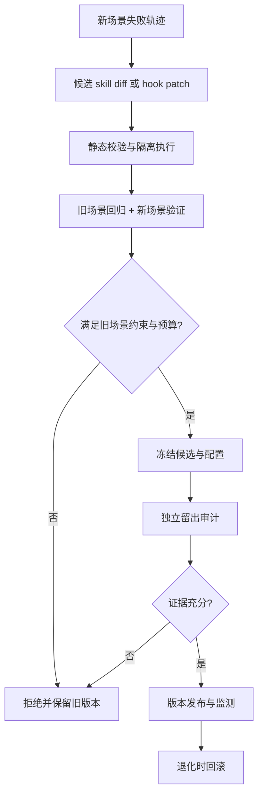

# Awesome RSI — 按实际修改对象分类

> 从“项目叫什么”转向“系统到底改了什么”：提示词、记忆、skills、hooks、工作流、agent 源码、任务程序，还是模型权重。

本 README 面向准备开发自改进开源项目的工程师，重点关注：**新场景如何改进 skills，以及如何验证旧场景没有退化。**

核查日期：2026-10-07。按实际修改对象组织项目，以关键源码路径和原始论文／官方资料作为分类证据。

## 覆盖与核查方法

- 收录 **60 个方法条目、37 个评测与背景条目**，另列 **22 个相关方法与 2 篇实践文章**。
- 同一仓库中的不同方法分开说明，仓库数量不与方法数量混算。
- 对可定位实现，读取固定提交下的关键函数、编辑/写回位置、训练入口或候选执行代码。下文的“源码核查”表示关键静态路径检查，**不是完整代码审计或实验复现**。
- 只下载/阅读源码，没有安装项目、执行其 agent、训练模型或复现性能。目录存在、README 宣称开源、发布模型权重，都不等于完整训练与搜索源码已公开。
- 无法确认作者实现的条目保留论文层分类，写明“未核验”；这表示此次调查的结果，不断言世界上没有任何代码。
- 单个方法可能修改多个对象。按主要部署/优化产物放入一组，正文保留其他对象；训练时变化和运行时变化分开记录。

## 修改对象的工程含义

| 类别 | 真正变化的资产 | 常见落盘形式 | 不应混淆的对象 |
| --- | --- | --- | --- |
| 提示词、指令与示例 | 指令、示例、文本参数 | prompt、配置中的字符串 | 语言“梯度”不必然更新 LLM 权重 |
| 上下文、经验与流程记忆 | 经验规则、反思、流程描述、检索条目 | JSON、文本、向量库 | 工作流记忆不一定是可执行工作流 |
| 技能文件、可执行技能与工具库 | 技能说明或可复用函数/API | SKILL.md、Python/JS、工具 schema | 文本 skill 和可执行 skill 需要分别标记 |
| 工作流、模块组合与图/控制器参数 | 控制流、节点、拓扑、模块组合、路由参数 | graph.py、DAG、控制器 checkpoint | 图参数不是基础 LLM 权重 |
| 运行时 hooks、动作校验与干预 | 生命周期中实际执行的干预函数 | Python hook、patch JSON | 自动生成提示只属于 hook 的一种作用 |
| agent / harness / 优化器自身源码 | agent、harness，或改进器实现 | Git diff、函数替换、版本提交 | 修改任务解不等于修改自己 |
| 目标任务程序与算法 | 被求解任务的算法/实现 | 函数、脚本、计算内核 | 程序演化不必然构成递归自改进 |
| 模型权重或与权重联合的更新 | 模型权重，以及与权重训练联合的代码／数据更新 | checkpoint、adapter、训练数据 | 图/控制器参数归入工作流类；须说明训练的是哪个模型 |
| 研究产物、实验代码与合成数据 | 假设、实验、论文、题目/数据 | 代码、报告、数据集 | 完成科研闭环不等于重写科研 agent |

RSI 在此指 Recursive Self-Improvement。提示词优化、技能积累、自动 agent 设计都有参考价值，但不能一概当作“优化器自身也越来越强”的递归闭环。

## 项目总览

“类别”与上表及下文分类标题使用同一套名称；“具体修改对象”说明实际变化的资产。一个项目可以涉及多个对象，此处按主要产物归类，其他变化保留在后两列及项目详情中。

| 项目 | 类别 | 具体修改对象 | 权重变化／核查边界 | 证据状态 |
| --- | --- | --- | --- | --- |
| APE | [提示词、指令与示例](#prompt) | 任务指令字符串 | 提示词生成与评测路径不微调目标模型 | 关键源码静态核查 |
| OPRO | [提示词、指令与示例](#prompt) | 自然语言指令候选 | 指令搜索使用模型推理；不是梯度训练 LLM | 关键源码静态核查 |
| EvoPrompt | [提示词、指令与示例](#prompt) | 提示词种群 | 所核查演化流程更新字符串种群 | 关键源码静态核查 |
| Promptbreeder | [提示词、指令与示例](#prompt) | 任务提示词 + 用于修改提示词的 mutation prompt | 所核查第三方实现不训练 LLM | 第三方实现关键源码核查 |
| ProTeGi | [提示词、指令与示例](#prompt) | 任务提示词 | “textual gradient”是语言反馈，不是目标 LLM 参数梯度 | 关键源码静态核查 |
| DSPy | [提示词、指令与示例](#prompt) | 模块指令、signature instructions、few-shot demonstrations | 这里核查的是 MIPROv2；DSPy 也存在其他训练型优化器 | 关键源码静态核查 |
| MIPROv2 | [提示词、指令与示例](#prompt) | 多模块指令和 few-shot 示例的组合 | 核查版本进行候选与贝叶斯搜索，不训练任务 LLM | 关键源码静态核查 |
| TextGrad | [提示词、指令与示例](#prompt) | requires_grad 的文本 Variable，例如提示词、答案或代码字符串 | textual gradient 不等于 LLM 权重梯度 | 关键源码静态核查 |
| GEPA | [提示词、指令与示例](#prompt) | 候选字典中的文本组件；适配器可将其解释为提示词、skill、代码等 | 反思搜索核心不做任务 LLM 的梯度更新 | 关键源码静态核查 |
| Reflexion | [上下文、经验与流程记忆](#memory) | 反思文本、回合经验上下文 | 所核查路径使用 LLM 推理，不做目标模型训练 | 关键源码静态核查 |
| ExpeL | [上下文、经验与流程记忆](#memory) | 经验规则、历史轨迹与检索示例 | 经验学习路径不更新目标 LLM 权重 | 关键源码静态核查 |
| Dynamic Cheatsheet | [上下文、经验与流程记忆](#memory) | 动态 cheatsheet 文本 | 测试时更新文本记忆，不等于微调 | 关键源码静态核查 |
| ACE | [上下文、经验与流程记忆](#memory) | playbook 的经验条目与元信息 | 所核查 curator 是 API 推理路径 | 关键源码静态核查 |
| ReasoningBank | [上下文、经验与流程记忆](#memory) | 成功／失败中归纳的推理经验 | 核查经验归纳路径使用推理调用 | 关键源码静态核查 |
| Agent Workflow Memory (AWM) | [上下文、经验与流程记忆](#memory) | 自然语言工作流记忆 | 归纳与检索路径不做目标 LLM 训练 | 关键源码静态核查 |
| Memp | [上下文、经验与流程记忆](#memory) | procedural memory 文档：步骤、策略与轨迹摘要 | 核查记忆路径不更新目标 LLM 权重 | 关键源码静态核查 |
| AgentRxiv | [上下文、经验与流程记忆](#memory) | 共享论文库、检索上下文与研究报告 | 已核查共享知识路径，不是 agent 权重训练 | 关键源码静态核查 |
| MCE | [技能文件、可执行技能与工具库](#skills) | 上下文工程 SKILL.md；其执行产生的上下文文件与代码 | 核查路径通过外部 agent 改文件，没有在此训练基础模型 | 关键源码静态核查 |
| Alita | [技能文件、可执行技能与工具库](#skills) | 论文中的动态 MCP 工具代码与复用工具库 | 论文机制层分类；实现未确认 | 论文/说明；核心源码未核验 |
| Voyager | [技能文件、可执行技能与工具库](#skills) | JavaScript 可执行技能、技能描述和检索库 | 此技能积累路径不微调 LLM | 关键源码静态核查 |
| SkillWeaver | [技能文件、可执行技能与工具库](#skills) | 网页操作的 Python/API 技能函数与知识库 | 核查探索/存储路径通过推理生成代码 | 关键源码静态核查 |
| CORAL | [技能文件、可执行技能与工具库](#skills) | 研究尝试代码、共享 notes 与可复用 skill 目录 | 核查技能共享不意味着 LLM 权重更新 | 关键源码静态核查 |
| gskill | [技能文件、可执行技能与工具库](#skills) | 技能说明文本 best_skills.txt，可注入提示词/skill 文件 | GEPA 搜索文本，不是对目标 coding agent 微调 | 关键源码静态核查 |
| ADAS / Meta Agent Search | [工作流、模块组合与图/控制器参数](#workflow) | 新 agent 的 forward() 实现代码 | 所核查 Meta Agent Search 调用固定模型生成代码 | 关键源码静态核查 |
| AFlow | [工作流、模块组合与图/控制器参数](#workflow) | 工作流 graph.py 与节点提示词 | 工作流搜索路径不微调目标 LLM | 关键源码静态核查 |
| GPTSwarm | [工作流、模块组合与图/控制器参数](#workflow) | 节点提示词 + 边连接概率/图参数 | 会梯度更新图结构参数；不等于更新基础 LLM 权重 | 关键源码静态核查 |
| AgentSquare | [工作流、模块组合与图/控制器参数](#workflow) | 规划、推理、记忆、工具使用模块的代码与组合 | 核查搜索通过推理生成候选模块 | 关键源码静态核查 |
| MaAS | [工作流、模块组合与图/控制器参数](#workflow) | 按 query 选择架构的 controller 参数及 agentic operators | 训练控制器/架构分布参数；不是基础任务 LLM 的权重 | 关键源码静态核查 |
| MASS | [工作流、模块组合与图/控制器参数](#workflow) | 局部/全局提示词 + 多 agent 拓扑 | 论文描述联合搜索；此次未定位作者实现 | 论文/说明；核心源码未核验 |
| EvoAgent | [工作流、模块组合与图/控制器参数](#workflow) | agent 的角色/功能配置、提示词及种群组合 | 所核查示例通过推理生成 agent 配置 | 关键源码静态核查 |
| Agent Symbolic Learning | [工作流、模块组合与图/控制器参数](#workflow) | 节点提示词、SOP/工作流、toolkit 的符号配置 | 语言反馈优化符号组件，不是自动训练基础 LLM | 关键源码静态核查 |
| AutoHarness | [运行时 hooks、动作校验与干预](#hooks) | 按环境生成的动作合法性检查函数，或直接动作策略代码 | 论文是 harness 合成；未来蒸馏基础模型属于后续方向 | 论文/说明；核心源码未核验 |
| Harness-R1 | [运行时 hooks、动作校验与干预](#hooks) | Python 生命周期 hooks | 训练工程师模型 SFT/GRPO；同阶段目标 agent 冻结 | 关键源码静态核查 |
| STOP | [agent / harness / 优化器自身源码](#selfcode) | improve_algorithm 优化器本身的源码 | 递归代码改进，模型推理权重保持在外部 | 关键源码静态核查 |
| Gödel Agent | [agent / harness / 优化器自身源码](#selfcode) | 运行时 Python 函数、类或模块逻辑 | 核查自修改路径不训练 LLM | 关键源码静态核查 |
| Darwin Gödel Machine (DGM) | [agent / harness / 优化器自身源码](#selfcode) | 编码 agent 的自身源码与工具/控制逻辑 | 核查自改进路径修改代码，不进行基础 LLM 训练 | 关键源码静态核查 |
| SICA | [agent / harness / 优化器自身源码](#selfcode) | 当前编码 agent 的代码库 | 核查循环选择 agent 版本后执行代码改进与评测 | 关键源码静态核查 |
| Meta-Harness | [agent / harness / 优化器自身源码](#selfcode) | 围绕固定模型的 harness 源码：上下文、检索、执行流程等 | 所核查例子保持 base model，搜索包装代码 | 关键源码静态核查 |
| Self-Harness | [agent / harness / 优化器自身源码](#selfcode) | repo_baseline.py 暴露的提示词、skills、子 agent、运行时恢复等组件 | 公开说明保持模型和评测器固定 | 关键源码静态核查 |
| Hyperagents | [agent / harness / 优化器自身源码](#selfcode) | 任务 agent 和 meta-agent 的代码库 | 所核查路径通过模型工具调用改代码 | 关键源码静态核查 |
| Ouroboros | [agent / harness / 优化器自身源码](#selfcode) | agent 核心源码及经过 review 的后继版本 | 核查演化机制是代码/提交更新 | 关键源码静态核查 |
| AlphaEvolve | [目标任务程序与算法](#program) | 问题求解算法/程序，例如数学构造和计算内核 | 原方法主要搜索程序；没有在此确认基础 LLM 训练 | 论文/说明；核心源码未核验 |
| FunSearch | [目标任务程序与算法](#program) | 指定待演化函数的程序体 | 核查开源核心使用 LLM 采样与程序评分 | 关键源码静态核查 |
| ShinkaEvolve | [目标任务程序与算法](#program) | 目标程序代码；可选演化 mutation/system prompt | 程序演化核心不等于基础 LLM 训练 | 关键源码静态核查 |
| ThetaEvolve | [目标任务程序与算法](#program) | 目标程序及程序生成策略 | 有演化 + RL 训练方向；具体训练参数需按配置确认 | 关键源码静态核查 |
| ELM | [目标任务程序与算法](#program) | 程序种群、代码 diff；论文另有用演化数据训练模型的阶段 | 搜索实现与论文后续训练阶段分开看 | 关键源码静态核查 |
| OpenEvolve | [目标任务程序与算法](#program) | 待优化程序源码及候选种群 | 核查核心通过 LLM 产生代码变体，不训练基础 LLM | 关键源码静态核查 |
| MemAct | [模型权重或与权重联合的更新](#weights) | 训练后的记忆管理策略；运行时消息/工作记忆 | 训练 actor 权重；运行时还删改上下文 | 关键源码静态核查 |
| ScoreFlow | [模型权重或与权重联合的更新](#weights) | 工作流生成模型的权重；生成的流程代码 | DPO 训练生成器，不能只归为无权重的 workflow search | 关键源码静态核查 |
| FlowReasoner | [模型权重或与权重联合的更新](#weights) | query-level 工作流生成模型；输出的工作流 | 作者描述 SFT + RL 更新 meta-agent；训练实现未在本次关键文件中确认 | 运行源码核查；训练部分仅资料确认 |
| SIA | [模型权重或与权重联合的更新](#weights) | harness/目标 agent 代码 + 可选 RL 权重更新流程 | harness 与 weights 两种模式，不能说每一轮都会同时改两者 | 关键源码静态核查 |
| SEAL | [模型权重或与权重联合的更新](#weights) | 自生成的训练数据/更新配置；适应后的模型权重 | 内循环适应模型，外循环学习 self-edit 生成策略 | 关键源码静态核查 |
| CycleResearcher | [模型权重或与权重联合的更新](#weights) | 研究论文生成模型/评审模型的权重；运行时论文文本 | 论文涉及训练；公开核查入口主要是模型加载与推理 | 运行源码核查；训练部分仅资料确认 |
| The AI Scientist-v2 | [研究产物、实验代码与合成数据](#research) | 实验实现代码、实验树节点、结果与论文产物 | 实验中可能训练研究对象，不等于训练 scientist agent | 关键源码静态核查 |
| Dolphin | [研究产物、实验代码与合成数据](#research) | 研究想法、实验实现、反馈记录 | 实验模型训练与 Dolphin agent 自身训练分开 | 关键源码静态核查 |
| NovelSeek / InternAgent | [研究产物、实验代码与合成数据](#research) | 研究计划、实验代码、历史 idea/经验 | 实验任务可能训练模型，不能推断基础 agent 每轮微调 | 关键源码静态核查 |
| AI co-scientist | [研究产物、实验代码与合成数据](#research) | 研究假设、评议和排序后的候选 | 论文机制层分类；未确认作者核心实现 | 论文/说明；核心源码未核验 |
| AIDE | [研究产物、实验代码与合成数据](#research) | 任务解的 ML 实验脚本及搜索树 | 训练被研究的模型，不等于训练 AIDE agent | 关键源码静态核查 |
| Autodata | [研究产物、实验代码与合成数据](#research) | 合成任务/题目/rubric；外循环还可改数据生成 harness | 官方说明还包含用生成数据训练下游模型 | 官方资料核查；未核验核心实现 |
| ResearchAgent | [研究产物、实验代码与合成数据](#research) | 研究问题、方法与实验设计文本 | 核查 pipeline 调用模型生成和评议，不训练 LLM | 关键源码静态核查 |

## 按修改对象展开

[提示词、指令与示例](#prompt) · [上下文、经验与流程记忆](#memory) · [技能文件、可执行技能与工具库](#skills) · [工作流、模块组合与图/控制器参数](#workflow) · [运行时 hooks、动作校验与干预](#hooks) · [agent / harness / 优化器自身源码](#selfcode) · [目标任务程序与算法](#program) · [模型权重或与权重联合的更新](#weights) · [研究产物、实验代码与合成数据](#research)

<a id="prompt"></a>

### 提示词、指令与示例

#### APE

[论文／原始说明](https://arxiv.org/abs/2211.01910) · [公开仓库](https://github.com/keirp/automatic_prompt_engineer) · [核查入口：automatic_prompt_engineer/ape.py](https://github.com/keirp/automatic_prompt_engineer/blob/eac521c79a78965245ce7745dcc9f6b0792c7ec7/automatic_prompt_engineer/ape.py)

- **主要修改**：任务指令字符串。
- **权重边界**：提示词生成与评测路径不微调目标模型。
- **源码／资料发现**：ape.py 调用 generate_prompts，再评测候选指令。
- **证据状态**：关键源码静态核查；未运行实验。

#### OPRO

[论文／原始说明](https://arxiv.org/abs/2309.03409) · [公开仓库](https://github.com/google-deepmind/opro) · [核查入口：opro/optimization/optimize_instructions.py](https://github.com/google-deepmind/opro/blob/a76bdce2cbf6d4a0d1e570a6fcfe17be9c2abdd7/opro/optimization/optimize_instructions.py)

- **主要修改**：自然语言指令候选。
- **权重边界**：指令搜索使用模型推理；不是梯度训练 LLM。
- **源码／资料发现**：optimize_instructions.py 配置 scorer/optimizer 模型与指令搜索；同仓库也有数值优化例子，此分类针对 prompt 方法。
- **证据状态**：关键源码静态核查；未运行实验。

#### EvoPrompt

[论文／原始说明](https://arxiv.org/abs/2309.08532) · [公开仓库](https://github.com/beeevita/EvoPrompt) · [核查入口：evoluter.py](https://github.com/beeevita/EvoPrompt/blob/94caff336555df99acc5c338c7930c40cc550ad9/evoluter.py)

- **主要修改**：提示词种群。
- **权重边界**：所核查演化流程更新字符串种群。
- **源码／资料发现**：evoluter.py 生成 new_pop，经评测后替换或筛选 population。
- **证据状态**：关键源码静态核查；未运行实验。

#### Promptbreeder

[论文／原始说明](https://arxiv.org/abs/2309.16797) · [公开仓库](https://github.com/dylski/promptbreeder) · [核查入口：mutator.py](https://github.com/dylski/promptbreeder/blob/e707e1e71fa89c27c26728b1af44836d700214d9/mutator.py)

- **主要修改**：任务提示词 + 用于修改提示词的 mutation prompt。
- **权重边界**：所核查第三方实现不训练 LLM。
- **源码／资料发现**：mutator.py 同时接收 current_task_prompt/current_mutation_prompt，包含 hypermutation；这是第三方最小复现，不是作者代码。
- **证据状态**：第三方实现关键源码核查；未运行实验。

#### ProTeGi

[论文／原始说明](https://arxiv.org/abs/2305.03495) · [公开仓库](https://github.com/microsoft/LMOps) · [核查入口：prompt_optimization/optimizers.py](https://github.com/microsoft/LMOps/blob/6f53ef41c951de0962bbf27fe3f5819eabc8ce0e/prompt_optimization/optimizers.py)

- **主要修改**：任务提示词。
- **权重边界**：“textual gradient”是语言反馈，不是目标 LLM 参数梯度。
- **源码／资料发现**：prompt_optimization/optimizers.py 根据错误反馈扩展 new_prompts；main.py 对候选做搜索与评测。
- **证据状态**：关键源码静态核查；未运行实验。

#### DSPy

[论文／原始说明](https://arxiv.org/abs/2310.03714) · [公开仓库](https://github.com/stanfordnlp/dspy) · [核查入口：dspy/teleprompt/mipro_optimizer_v2.py](https://github.com/stanfordnlp/dspy/blob/bc8af7ed3d5ee0b892211e5c03274396442a413c/dspy/teleprompt/mipro_optimizer_v2.py)

- **主要修改**：模块指令、signature instructions、few-shot demonstrations。
- **权重边界**：这里核查的是 MIPROv2；DSPy 也存在其他训练型优化器。
- **源码／资料发现**：编译器给 predictor 设置指令和 demos。不能把一个优化器的行为扩展到整个 DSPy 框架。
- **证据状态**：关键源码静态核查；未运行实验。

#### MIPROv2

[论文／原始说明](https://arxiv.org/abs/2406.11695) · [公开仓库](https://github.com/stanfordnlp/dspy) · [核查入口：dspy/teleprompt/mipro_optimizer_v2.py](https://github.com/stanfordnlp/dspy/blob/bc8af7ed3d5ee0b892211e5c03274396442a413c/dspy/teleprompt/mipro_optimizer_v2.py)

- **主要修改**：多模块指令和 few-shot 示例的组合。
- **权重边界**：核查版本进行候选与贝叶斯搜索，不训练任务 LLM。
- **源码／资料发现**：_optimize_prompt_parameters() 搜索 instruction/demo 索引，给 predictor.demos 赋值。与 DSPy 共用仓库。
- **证据状态**：关键源码静态核查；未运行实验。

#### TextGrad

[论文／原始说明](https://arxiv.org/abs/2406.07496) · [公开仓库](https://github.com/zou-group/textgrad) · [核查入口：textgrad/optimizer/optimizer.py](https://github.com/zou-group/textgrad/blob/75e912e210864b61999781778cdf756d4468120f/textgrad/optimizer/optimizer.py)

- **主要修改**：requires_grad 的文本 Variable，例如提示词、答案或代码字符串。
- **权重边界**：textual gradient 不等于 LLM 权重梯度。
- **源码／资料发现**：TextualGradientDescent.step() 生成 new_value，调用 parameter.set_value(new_value)。修改对象由调用者提供的 Variable 决定。
- **证据状态**：关键源码静态核查；未运行实验。

#### GEPA

[论文／原始说明](https://arxiv.org/abs/2507.19457) · [公开仓库](https://github.com/gepa-ai/gepa) · [核查入口：src/gepa/proposer/reflective_mutation/reflective_mutation.py](https://github.com/gepa-ai/gepa/blob/fb1ed589fd83372caef499cffc2c73173d3b096b/src/gepa/proposer/reflective_mutation/reflective_mutation.py)

- **主要修改**：候选字典中的文本组件；适配器可将其解释为提示词、skill、代码等。
- **权重边界**：反思搜索核心不做任务 LLM 的梯度更新。
- **源码／资料发现**：ReflectiveMutationProposer 建立反思数据并调用 propose_new_texts/custom proposer。实际可编辑对象由 adapter 定义。
- **证据状态**：关键源码静态核查；未运行实验。

<a id="memory"></a>

### 上下文、经验与流程记忆

#### Reflexion

[论文／原始说明](https://arxiv.org/abs/2303.11366) · [公开仓库](https://github.com/noahshinn/reflexion) · [核查入口：hotpotqa_runs/agents.py](https://github.com/noahshinn/reflexion/blob/218cf0ef1df84b05ce379dd4a8e47f17766733a0/hotpotqa_runs/agents.py)

- **主要修改**：反思文本、回合经验上下文。
- **权重边界**：所核查路径使用 LLM 推理，不做目标模型训练。
- **源码／资料发现**：reflect() 更新 reflections，并把 reflections_str 放入下一次提示。
- **证据状态**：关键源码静态核查；未运行实验。

#### ExpeL

[论文／原始说明](https://arxiv.org/abs/2308.10144) · [公开仓库](https://github.com/LeapLabTHU/ExpeL) · [核查入口：agent/expel.py](https://github.com/LeapLabTHU/ExpeL/blob/e41ec9a24823e7b560c561ab191441b56d9bcefc/agent/expel.py)

- **主要修改**：经验规则、历史轨迹与检索示例。
- **权重边界**：经验学习路径不更新目标 LLM 权重。
- **源码／资料发现**：ExpelAgent 保存成功/失败轨迹；规则处理函数增删规则并按计数筛选。
- **证据状态**：关键源码静态核查；未运行实验。

#### Dynamic Cheatsheet

[论文／原始说明](https://arxiv.org/abs/2504.07952) · [公开仓库](https://github.com/suzgunmirac/dynamic-cheatsheet) · [核查入口：dynamic_cheatsheet/language_model.py](https://github.com/suzgunmirac/dynamic-cheatsheet/blob/5cfe3c37e8e52b1d858d0f3df46e7f17c50991b9/dynamic_cheatsheet/language_model.py)

- **主要修改**：动态 cheatsheet 文本。
- **权重边界**：测试时更新文本记忆，不等于微调。
- **源码／资料发现**：language_model.py 生成 new_cheatsheet；下一轮把它作为 previous cheatsheet 输入。
- **证据状态**：关键源码静态核查；未运行实验。

#### ACE

[论文／原始说明](https://arxiv.org/abs/2510.04618) · [公开仓库](https://github.com/ace-agent/ace) · [核查入口：ace/core/curator.py](https://github.com/ace-agent/ace/blob/82709de050e1db6e6ef2f07bcb0393560b94992a/ace/core/curator.py)

- **主要修改**：playbook 的经验条目与元信息。
- **权重边界**：所核查 curator 是 API 推理路径。
- **源码／资料发现**：curator.py 产生结构化 operations；核查版本注释明确 ADD 支持较完整，其他操作可能未完全支持，不能把论文所有操作视为实现完备。
- **证据状态**：关键源码静态核查；未运行实验。

#### ReasoningBank

[论文／原始说明](https://arxiv.org/abs/2509.25140) · [公开仓库](https://github.com/google-research/reasoning-bank) · [核查入口：WebArena/induce_memory.py](https://github.com/google-research/reasoning-bank/blob/ed80611788292ea739f1effd31f16c53823b8a0d/WebArena/induce_memory.py)

- **主要修改**：成功／失败中归纳的推理经验。
- **权重边界**：核查经验归纳路径使用推理调用。
- **源码／资料发现**：induce_memory.py 按成功/失败选择不同提示，生成 memory item；memory_management.py 负责检索。
- **证据状态**：关键源码静态核查；未运行实验。

#### Agent Workflow Memory (AWM)

[论文／原始说明](https://arxiv.org/abs/2409.07429) · [公开仓库](https://github.com/zorazrw/agent-workflow-memory) · [核查入口：mind2web/online_induction.py](https://github.com/zorazrw/agent-workflow-memory/blob/8c0ff8cd11d648c8fceb99e4e42f37e3b75381b1/mind2web/online_induction.py)

- **主要修改**：自然语言工作流记忆。
- **权重边界**：归纳与检索路径不做目标 LLM 训练。
- **源码／资料发现**：online_induction.py 从经历归纳工作流并写入文件；此处的 workflow 是记忆内容，不是执行图源码重写。
- **证据状态**：关键源码静态核查；未运行实验。

#### Memp

[论文／原始说明](https://arxiv.org/abs/2508.06433) · [公开仓库](https://github.com/zjunlp/MemP) · [核查入口：ProcedureMem/memory.py](https://github.com/zjunlp/MemP/blob/3066a1b280a39c7433ae37d9a745861903a5d3c4/ProcedureMem/memory.py)

- **主要修改**：procedural memory 文档：步骤、策略与轨迹摘要。
- **权重边界**：核查记忆路径不更新目标 LLM 权重。
- **源码／资料发现**：ProcedureMem/memory.py 提供 build/retrieve/update，并删除、补充和保存文档。脚本式流程描述不应自动认作可执行 skill。
- **证据状态**：关键源码静态核查；未运行实验。

#### AgentRxiv

[论文／原始说明](https://arxiv.org/abs/2503.18102) · [公开仓库](https://github.com/SamuelSchmidgall/AgentLaboratory) · [核查入口：ai_lab_repo.py](https://github.com/SamuelSchmidgall/AgentLaboratory/blob/d9017d90e329112d2a80b7712f37ee9094d2cd27/ai_lab_repo.py)

- **主要修改**：共享论文库、检索上下文与研究报告。
- **权重边界**：已核查共享知识路径，不是 agent 权重训练。
- **源码／资料发现**：官方站 Code 链接指向 AgentLaboratory；ai_lab_repo.py 的 AgentRxiv 类搜索共享报告，并把研究 PDF 写入 uploads。
- **证据状态**：关键源码静态核查；未运行实验。

<a id="skills"></a>

### 技能文件、可执行技能与工具库

#### MCE

[论文／原始说明](https://arxiv.org/abs/2601.21557) · [公开仓库](https://github.com/metaevo-ai/meta-context-engineering) · [核查入口：mce/meta_agent.py](https://github.com/metaevo-ai/meta-context-engineering/blob/c4b7a7c2ce3ffc4bf4a74c52d2dd8a9a8fb14c30/mce/meta_agent.py) · [补充源码：mce/base_agent.py](https://github.com/metaevo-ai/meta-context-engineering/blob/c4b7a7c2ce3ffc4bf4a74c52d2dd8a9a8fb14c30/mce/base_agent.py)

- **主要修改**：上下文工程 SKILL.md；其执行产生的上下文文件与代码。
- **权重边界**：核查路径通过外部 agent 改文件，没有在此训练基础模型。
- **源码／资料发现**：meta_agent.py 验证 .claude/skills/learning-context/SKILL.md；base_agent.py 授权在迭代目录读写上下文产物。
- **证据状态**：关键源码静态核查；未运行实验。

#### Alita

[论文／原始说明](https://arxiv.org/abs/2505.20286) · [公开仓库](https://github.com/CharlesQ9/Alita)

- **主要修改**：论文中的动态 MCP 工具代码与复用工具库。
- **权重边界**：论文机制层分类；实现未确认。
- **源码／资料发现**：核查 CharlesQ9/Alita 固定提交只有 README 和图片，没有核心源码；README 的计划发布不能当作已发布。
- **证据状态**：论文/说明；核心源码未核验；未运行实验。

#### Voyager

[论文／原始说明](https://arxiv.org/abs/2305.16291) · [公开仓库](https://github.com/MineDojo/Voyager) · [核查入口：voyager/agents/skill.py](https://github.com/MineDojo/Voyager/blob/55e45a880755d0c8c66ca7fb5fe7962ac8974f89/voyager/agents/skill.py)

- **主要修改**：JavaScript 可执行技能、技能描述和检索库。
- **权重边界**：此技能积累路径不微调 LLM。
- **源码／资料发现**：SkillManager.add_new_skill() 保存 code/description，并将描述写入向量库；retrieve_skills() 返回代码。
- **证据状态**：关键源码静态核查；未运行实验。

#### SkillWeaver

[论文／原始说明](https://arxiv.org/abs/2504.07079) · [公开仓库](https://github.com/OSU-NLP-Group/SkillWeaver) · [核查入口：skillweaver/knowledge_base/knowledge_base.py](https://github.com/OSU-NLP-Group/SkillWeaver/blob/f2a63d65d0f6ff46ac30e817cede8797f8f25b97/skillweaver/knowledge_base/knowledge_base.py)

- **主要修改**：网页操作的 Python/API 技能函数与知识库。
- **权重边界**：核查探索/存储路径通过推理生成代码。
- **源码／资料发现**：knowledge_base.py 维护函数、schema 和技能代码；explore.py 组织探索实践。新增函数及其验证与纯文本记忆不同。
- **证据状态**：关键源码静态核查；未运行实验。

#### CORAL

[论文／原始说明](https://arxiv.org/abs/2604.01658) · [公开仓库](https://github.com/Human-Agent-Society/CORAL) · [核查入口：coral/hub/skills.py](https://github.com/Human-Agent-Society/CORAL/blob/0123dfb939b35228cf2c1fde224cd0561e727408/coral/hub/skills.py)

- **主要修改**：研究尝试代码、共享 notes 与可复用 skill 目录。
- **权重边界**：核查技能共享不意味着 LLM 权重更新。
- **源码／资料发现**：coral/hub/skills.py 读取 skill 目录/文件；主要还演化任务程序。共享技能支持存在，不应扩展为已证明自动改写优化器。
- **证据状态**：关键源码静态核查；未运行实验。

#### gskill

[论文／原始说明](https://gepa-ai.github.io/gepa/guides/gskill/) · [公开仓库](https://github.com/gepa-ai/gepa) · [核查入口：src/gepa/gskill/gskill/train_optimize_anything.py](https://github.com/gepa-ai/gepa/blob/fb1ed589fd83372caef499cffc2c73173d3b096b/src/gepa/gskill/gskill/train_optimize_anything.py)

- **主要修改**：技能说明文本 best_skills.txt，可注入提示词/skill 文件。
- **权重边界**：GEPA 搜索文本，不是对目标 coding agent 微调。
- **源码／资料发现**：train_optimize_anything.py 的 proposer 接收 curr_skills 与执行反馈，产生新的 skills 候选。与 GEPA 共用源码仓库。
- **证据状态**：关键源码静态核查；未运行实验。

<a id="workflow"></a>

### 工作流、模块组合与图/控制器参数

#### ADAS / Meta Agent Search

[论文／原始说明](https://arxiv.org/abs/2408.08435) · [公开仓库](https://github.com/ShengranHu/ADAS) · [核查入口：_mgsm/search.py](https://github.com/ShengranHu/ADAS/blob/2702bee8fefda42255efc5be9f60e3bd3db96ae4/_mgsm/search.py)

- **主要修改**：新 agent 的 forward() 实现代码。
- **权重边界**：所核查 Meta Agent Search 调用固定模型生成代码。
- **源码／资料发现**：search.py 编译生成的 forward_str，再把函数装到 AgentSystem.forward 上评测。它搜索 agent 设计，不足以证明优化器自身递归改进。
- **证据状态**：关键源码静态核查；未运行实验。

#### AFlow

[论文／原始说明](https://arxiv.org/abs/2410.10762) · [公开仓库](https://github.com/FoundationAgents/AFlow) · [核查入口：scripts/optimizer.py](https://github.com/FoundationAgents/AFlow/blob/3f457218fc716093fe53f6df8a5d5e6379d66346/scripts/optimizer.py)

- **主要修改**：工作流 graph.py 与节点提示词。
- **权重边界**：工作流搜索路径不微调目标 LLM。
- **源码／资料发现**：optimizer.py 产生、加载并评测不同轮次的 graph；README 提醒独立仓库迁移后的部分 Operator 可能有问题。
- **证据状态**：关键源码静态核查；未运行实验。

#### GPTSwarm

[论文／原始说明](https://arxiv.org/abs/2402.16823) · [公开仓库](https://github.com/metauto-ai/gptswarm) · [核查入口：swarm/optimizer/edge_optimizer/optimization.py](https://github.com/metauto-ai/gptswarm/blob/c23a827f561c934ce21dd950408f7606aa4a8821/swarm/optimizer/edge_optimizer/optimization.py)

- **主要修改**：节点提示词 + 边连接概率/图参数。
- **权重边界**：会梯度更新图结构参数；不等于更新基础 LLM 权重。
- **源码／资料发现**：edge_optimizer/optimization.py 对连接分布执行 loss.backward()/optimizer.step()；node_optimizer 包含提示词优化。
- **证据状态**：关键源码静态核查；未运行实验。

#### AgentSquare

[论文／原始说明](https://arxiv.org/abs/2410.06153) · [公开仓库](https://github.com/tsinghua-fib-lab/AgentSquare) · [核查入口：search/module_evolution.py](https://github.com/tsinghua-fib-lab/AgentSquare/blob/8f5b3fe5d8a32f9b59d20370823bef2a2c86928c/search/module_evolution.py)

- **主要修改**：规划、推理、记忆、工具使用模块的代码与组合。
- **权重边界**：核查搜索通过推理生成候选模块。
- **源码／资料发现**：module_evolution.py 分别生成四类模块并替换 agent 组合中的模块名；tool-use 模块变化不等于真实外部工具实现被重写。
- **证据状态**：关键源码静态核查；未运行实验。

#### MaAS

[论文／原始说明](https://arxiv.org/abs/2502.04180) · [公开仓库](https://github.com/bingreeky/MaAS) · [核查入口：maas/ext/maas/models/controller.py](https://github.com/bingreeky/MaAS/blob/987f3c1bc9a96e844fe090db3791446e3ef0f5c7/maas/ext/maas/models/controller.py)

- **主要修改**：按 query 选择架构的 controller 参数及 agentic operators。
- **权重边界**：训练控制器/架构分布参数；不是基础任务 LLM 的权重。
- **源码／资料发现**：models/controller.py 包含可训练 Linear 编码器；optimizer.py 使用 controller 与 optimizer 采样和评测子网络。
- **证据状态**：关键源码静态核查；未运行实验。

#### MASS

[论文／原始说明](https://arxiv.org/abs/2502.02533)

- **主要修改**：局部/全局提示词 + 多 agent 拓扑。
- **权重边界**：论文描述联合搜索；此次未定位作者实现。
- **源码／资料发现**：原始论文描述分阶段优化提示词和拓扑；这里只给论文层分类，不声称源码确认。
- **证据状态**：论文/说明；核心源码未核验；未运行实验。

#### EvoAgent

[论文／原始说明](https://arxiv.org/abs/2406.14228) · [公开仓库](https://github.com/siyuyuan/EvoAgent) · [核查入口：spp/agent_prompt_logic.py](https://github.com/siyuyuan/EvoAgent/blob/fc6d087b119df69466c2372cfcaf588c040aaba8/spp/agent_prompt_logic.py) · [补充源码：spp/llm_evoagent.py](https://github.com/siyuyuan/EvoAgent/blob/fc6d087b119df69466c2372cfcaf588c040aaba8/spp/llm_evoagent.py)

- **主要修改**：agent 的角色/功能配置、提示词及种群组合。
- **权重边界**：所核查示例通过推理生成 agent 配置。
- **源码／资料发现**：agent_prompt_logic.py 的 meta 模板生成专家角色描述，check 模板按贡献和独特性决定 Retain/Discard，multi 模板把描述注入专家提示；llm_evoagent.py 编排调用。不是修改每个 agent 的基础模型权重。
- **证据状态**：关键源码静态核查；未运行实验。

#### Agent Symbolic Learning

[论文／原始说明](https://arxiv.org/abs/2406.18532) · [公开仓库](https://github.com/aiwaves-cn/agents) · [核查入口：src/agents/optimization/sop_optimizer.py](https://github.com/aiwaves-cn/agents/blob/e8c4e3c2d19739d3dff59e577d1c97090cc15f59/src/agents/optimization/sop_optimizer.py)

- **主要修改**：节点提示词、SOP/工作流、toolkit 的符号配置。
- **权重边界**：语言反馈优化符号组件，不是自动训练基础 LLM。
- **源码／资料发现**：optimization 目录有 prompt_optimizer、sop_optimizer、toolkit_optimizer。已核查提示词/SOP 入口；工具优化接口存在不证明所有场景会改工具源码。
- **证据状态**：关键源码静态核查；未运行实验。

<a id="hooks"></a>

### 运行时 hooks、动作校验与干预

#### AutoHarness

[论文／原始说明](https://arxiv.org/abs/2603.03329)

- **主要修改**：按环境生成的动作合法性检查函数，或直接动作策略代码。
- **权重边界**：论文是 harness 合成；未来蒸馏基础模型属于后续方向。
- **源码／资料发现**：补充定位原论文 2603.03329；有函数签名/代码示例，未定位完整作者仓库。不要混用 aiming-lab 等同名 AutoHarness。
- **证据状态**：论文/说明；核心源码未核验；未运行实验。

#### Harness-R1

[论文／原始说明](https://arxiv.org/abs/2608.02276) · [公开仓库](https://github.com/DeepExperience/Harness-R1) · [核查入口：code/life-harness/AgentBench/scripts/harness_r1_patch.py](https://github.com/DeepExperience/Harness-R1/blob/94f2e087f573e1b82fc9568bb634d4ae9a887e28/code/life-harness/AgentBench/scripts/harness_r1_patch.py) · [补充源码：scripts/train_engineer_sft.sh](https://github.com/DeepExperience/Harness-R1/blob/94f2e087f573e1b82fc9568bb634d4ae9a887e28/scripts/train_engineer_sft.sh) · [补充源码：scripts/train_engineer_rl.sh](https://github.com/DeepExperience/Harness-R1/blob/94f2e087f573e1b82fc9568bb634d4ae9a887e28/scripts/train_engineer_rl.sh)

- **主要修改**：Python 生命周期 hooks。
- **权重边界**：训练工程师模型 SFT/GRPO；同阶段目标 agent 冻结。
- **源码／资料发现**：harness_r1_patch.py 限定 add_code_hook；CODE_HOOKS 包含 on_init/make_pre_hint/on_before_action/on_post_step；code_runner.py 校验执行。
- **证据状态**：关键源码静态核查；未运行实验。

<a id="selfcode"></a>

### agent / harness / 优化器自身源码

#### STOP

[论文／原始说明](https://arxiv.org/abs/2310.02304) · [公开仓库](https://github.com/microsoft/stop) · [核查入口：run_improver.py](https://github.com/microsoft/stop/blob/0d6780c54306b2486dd36e9c4ae9b49aceb27ea4/run_improver.py)

- **主要修改**：improve_algorithm 优化器本身的源码。
- **权重边界**：递归代码改进，模型推理权重保持在外部。
- **源码／资料发现**：run_improver.py 把新算法源码写入版本文件，再加载为下一轮 improve_algorithm。关键区别是优化器成为被优化对象。
- **证据状态**：关键源码静态核查；未运行实验。

#### Gödel Agent

[论文／原始说明](https://arxiv.org/abs/2410.04444) · [公开仓库](https://github.com/Arvid-pku/Godel_Agent) · [核查入口：src/agent_module.py](https://github.com/Arvid-pku/Godel_Agent/blob/bbb508796be31c7140cdfc7106efd830a1324242/src/agent_module.py)

- **主要修改**：运行时 Python 函数、类或模块逻辑。
- **权重边界**：核查自修改路径不训练 LLM。
- **源码／资料发现**：action_adjust_logic() 编译执行 new_code，并增删/替换运行时逻辑。属于 monkey-patching，比固定 hook 的编辑面更宽。
- **证据状态**：关键源码静态核查；未运行实验。

#### Darwin Gödel Machine (DGM)

[论文／原始说明](https://arxiv.org/abs/2505.22954) · [公开仓库](https://github.com/jennyzzt/dgm) · [核查入口：self_improve_step.py](https://github.com/jennyzzt/dgm/blob/a565fd2d1dca504ef5104a7cc0f3bdc4ab9b4fd2/self_improve_step.py)

- **主要修改**：编码 agent 的自身源码与工具/控制逻辑。
- **权重边界**：核查自改进路径修改代码，不进行基础 LLM 训练。
- **源码／资料发现**：self_improve_step.py 诊断问题、生成补丁，并调用编码基准重跑；DGM_outer.py 管理候选档案。
- **证据状态**：关键源码静态核查；未运行实验。

#### SICA

[论文／原始说明](https://arxiv.org/abs/2504.15228) · [公开仓库](https://github.com/MaximeRobeyns/self_improving_coding_agent) · [核查入口：runner.py](https://github.com/MaximeRobeyns/self_improving_coding_agent/blob/ed8275dca4d3c5dbf77229964351fe9b424797dc/runner.py)

- **主要修改**：当前编码 agent 的代码库。
- **权重边界**：核查循环选择 agent 版本后执行代码改进与评测。
- **源码／资料发现**：runner.py 选择基础版本、启动容器、归档与执行 benchmark；修改目标是 agent 的实现，不只是单个任务答案。
- **证据状态**：关键源码静态核查；未运行实验。

#### Meta-Harness

[论文／原始说明](https://arxiv.org/abs/2603.28052) · [公开仓库](https://github.com/stanford-iris-lab/meta-harness) · [核查入口：reference_examples/terminal_bench_2/meta_harness.py](https://github.com/stanford-iris-lab/meta-harness/blob/8123ccabe2b19fa1123090b2e5f1bacc20963ce8/reference_examples/terminal_bench_2/meta_harness.py)

- **主要修改**：围绕固定模型的 harness 源码：上下文、检索、执行流程等。
- **权重边界**：所核查例子保持 base model，搜索包装代码。
- **源码／资料发现**：meta_harness.py 调用 proposer 产生候选 import path，校验后评测；分类是 harness 代码搜索，不能仅因名字有 meta 就说优化器源码被递归修改。
- **证据状态**：关键源码静态核查；未运行实验。

#### Self-Harness

[论文／原始说明](https://arxiv.org/abs/2606.09498) · [公开仓库](https://github.com/qzzqzzb/Self-Harness) · [核查入口：workflow/scripts/run_self_harness_loop.py](https://github.com/qzzqzzb/Self-Harness/blob/2720dbb3f52283684f4b85a1065d642df1779dd8/workflow/scripts/run_self_harness_loop.py)

- **主要修改**：repo_baseline.py 暴露的提示词、skills、子 agent、运行时恢复等组件。
- **权重边界**：公开说明保持模型和评测器固定。
- **源码／资料发现**：repo_baseline.py 有 build_system_prompt/build_skills 等入口；run_self_harness_loop.py 管理候选、回归验证与接受。已核查这些入口，未复现完整自动提案流程。
- **证据状态**：关键源码静态核查；未运行实验。

#### Hyperagents

[论文／原始说明](https://arxiv.org/abs/2603.19461) · [公开仓库](https://github.com/facebookresearch/Hyperagents) · [核查入口：meta_agent.py](https://github.com/facebookresearch/Hyperagents/blob/59a68f672dfb92c74aeb7e61535d776fb36e172d/meta_agent.py)

- **主要修改**：任务 agent 和 meta-agent 的代码库。
- **权重边界**：所核查路径通过模型工具调用改代码。
- **源码／资料发现**：MetaAgent.forward() 明确让 agent 修改 repo_path 中任意代码；允许 meta-agent 也成为修改对象。
- **证据状态**：关键源码静态核查；未运行实验。

#### Ouroboros

[论文／原始说明](https://arxiv.org/abs/2608.08311) · [公开仓库](https://github.com/razzant/ouroboros) · [核查入口：ouroboros/tools/git_evolution.py](https://github.com/razzant/ouroboros/blob/4b37f96223b4b8248eea80c9be22cf923759cd5a/ouroboros/tools/git_evolution.py)

- **主要修改**：agent 核心源码及经过 review 的后继版本。
- **权重边界**：核查演化机制是代码/提交更新。
- **源码／资料发现**：post_task_evolution.py 与 tools/git_evolution.py 管理演化与 reviewed-commit 权限边界；不能把 Web UI 的 evolution.js 当作核心自改进实现。
- **证据状态**：关键源码静态核查；未运行实验。

<a id="program"></a>

### 目标任务程序与算法

#### AlphaEvolve

[论文／原始说明](https://arxiv.org/abs/2506.13131)

- **主要修改**：问题求解算法/程序，例如数学构造和计算内核。
- **权重边界**：原方法主要搜索程序；没有在此确认基础 LLM 训练。
- **源码／资料发现**：未定位完整官方 AlphaEvolve 核心实现；公开结果或示例不是完整搜索系统。补充 OpenEvolve 单独作为第三方实现。
- **证据状态**：论文/说明；核心源码未核验；未运行实验。

#### FunSearch

[论文／原始说明](https://www.nature.com/articles/s41586-023-06924-6) · [公开仓库](https://github.com/google-deepmind/funsearch) · [核查入口：implementation/sampler.py](https://github.com/google-deepmind/funsearch/blob/cc53f274237d7ab05c19df939edbc1f9616a7c19/implementation/sampler.py)

- **主要修改**：指定待演化函数的程序体。
- **权重边界**：核查开源核心使用 LLM 采样与程序评分。
- **源码／资料发现**：sampler.py 产生函数候选，evaluator.py 执行评分，programs_database.py 存储种群。发布核心并不自动包含论文全部模型与资源。
- **证据状态**：关键源码静态核查；未运行实验。

#### ShinkaEvolve

[论文／原始说明](https://arxiv.org/abs/2509.19349) · [公开仓库](https://github.com/SakanaAI/ShinkaEvolve) · [核查入口：shinka/core/async_runner.py](https://github.com/SakanaAI/ShinkaEvolve/blob/8adc053a2ce4511ad2ac310e004c530a73fb974a/shinka/core/async_runner.py)

- **主要修改**：目标程序代码；可选演化 mutation/system prompt。
- **权重边界**：程序演化核心不等于基础 LLM 训练。
- **源码／资料发现**：async_runner.py 管理程序变体，prompt_evolver.py 单独演化系统提示词；核查版本支持的对象比仅“改程序”更广。
- **证据状态**：关键源码静态核查；未运行实验。

#### ThetaEvolve

[论文／原始说明](https://arxiv.org/abs/2511.23473) · [公开仓库](https://github.com/ypwang61/ThetaEvolve) · [核查入口：openevolve_adapted/openevolve/controller.py](https://github.com/ypwang61/ThetaEvolve/blob/7c12898f5d7627af403e3aca643af76199fb5c20/openevolve_adapted/openevolve/controller.py)

- **主要修改**：目标程序及程序生成策略。
- **权重边界**：有演化 + RL 训练方向；具体训练参数需按配置确认。
- **源码／资料发现**：核查 openevolve_adapted 的控制器/运行入口及 run.sh；源码含训练脚本。此处不能把它简单写成权重永远冻结。
- **证据状态**：关键源码静态核查；未运行实验。

#### ELM

[论文／原始说明](https://arxiv.org/abs/2206.08896) · [公开仓库](https://github.com/CarperAI/OpenELM) · [核查入口：src/openelm/mutation_model.py](https://github.com/CarperAI/OpenELM/blob/c844e149e3f59fef546e0bc55f4e12e0f192feb9/src/openelm/mutation_model.py)

- **主要修改**：程序种群、代码 diff；论文另有用演化数据训练模型的阶段。
- **权重边界**：搜索实现与论文后续训练阶段分开看。
- **源码／资料发现**：OpenELM 的 mutation_model.py 生成代码并 apply_diff；这是公开库实现，不代表原论文所有训练实验已复现。
- **证据状态**：关键源码静态核查；未运行实验。

#### OpenEvolve

[论文／原始说明](https://github.com/algorithmicsuperintelligence/openevolve) · [公开仓库](https://github.com/algorithmicsuperintelligence/openevolve) · [核查入口：openevolve/controller.py](https://github.com/algorithmicsuperintelligence/openevolve/blob/9196d8763300d1e46cc8b48cb0dc987966db3d48/openevolve/controller.py)

- **主要修改**：待优化程序源码及候选种群。
- **权重边界**：核查核心通过 LLM 产生代码变体，不训练基础 LLM。
- **源码／资料发现**：openevolve/controller.py 管理演化、评测、checkpoint 和 best_program.code；是 AlphaEvolve 风格第三方框架，不是 DeepMind 原实现。
- **证据状态**：关键源码静态核查；未运行实验。

<a id="weights"></a>

### 模型权重或与权重联合的更新

#### MemAct

[论文／原始说明](https://arxiv.org/abs/2510.12635) · [公开仓库](https://github.com/ADaM-BJTU/MemAct) · [核查入口：verl/experimental/agent_loop/mem_agent_loop.py](https://github.com/ADaM-BJTU/MemAct/blob/eba053e0d02e779b658a2db110d8697f157022c1/verl/experimental/agent_loop/mem_agent_loop.py) · [补充源码：verl/trainer/main_ppo.py](https://github.com/ADaM-BJTU/MemAct/blob/eba053e0d02e779b658a2db110d8697f157022c1/verl/trainer/main_ppo.py)

- **主要修改**：训练后的记忆管理策略；运行时消息/工作记忆。
- **权重边界**：训练 actor 权重；运行时还删改上下文。
- **源码／资料发现**：mem_agent_loop.py 执行删除消息等记忆动作；main_ppo.py 构造 RayPPOTrainer 并调用 fit()。
- **证据状态**：关键源码静态核查；未运行实验。

#### ScoreFlow

[论文／原始说明](https://arxiv.org/abs/2502.04306) · [公开仓库](https://github.com/Gen-Verse/ScoreFlow) · [核查入口：ScoreFlow/DPOtrainer.py](https://github.com/Gen-Verse/ScoreFlow/blob/2492563838f75d00c6830b6c5373fa3a81b2dbc8/ScoreFlow/DPOtrainer.py)

- **主要修改**：工作流生成模型的权重；生成的流程代码。
- **权重边界**：DPO 训练生成器，不能只归为无权重的 workflow search。
- **源码／资料发现**：ScoreFlow/DPOtrainer.py 定义 DPOTrainer；generate.py 提供流程生成。需要区分流程生成模型和执行流程的模型。
- **证据状态**：关键源码静态核查；未运行实验。

#### FlowReasoner

[论文／原始说明](https://arxiv.org/abs/2504.15257) · [公开仓库](https://github.com/sail-sg/FlowReasoner) · [核查入口：code/metagpt/ext/aflow/scripts/optimizer.py](https://github.com/sail-sg/FlowReasoner/blob/e22572e0f8997ff93f8421529fe6a01a4dfb8286/code/metagpt/ext/aflow/scripts/optimizer.py)

- **主要修改**：query-level 工作流生成模型；输出的工作流。
- **权重边界**：作者描述 SFT + RL 更新 meta-agent；训练实现未在本次关键文件中确认。
- **源码／资料发现**：核查 optimizer.py 的 graph 生成/评测路径；README 的 Training Stage 指向 LLaMA-Factory/EasyRL。运行路径有代码，完整训练复现仍待核实。
- **证据状态**：运行源码核查；训练部分仅资料确认；未运行实验。

#### SIA

[论文／原始说明](https://arxiv.org/abs/2605.27276) · [公开仓库](https://github.com/hexo-ai/sia) · [核查入口：sia/orchestrator.py](https://github.com/hexo-ai/sia/blob/7fd04d07bd2f47a110115674432b73622ebf7455/sia/orchestrator.py)

- **主要修改**：harness/目标 agent 代码 + 可选 RL 权重更新流程。
- **权重边界**：harness 与 weights 两种模式，不能说每一轮都会同时改两者。
- **源码／资料发现**：sia/orchestrator.py 按 focus 选择 harness/code 或 weights/RL 模式，weights 路径要求 Tinker；需区分优化目标权重和调用工程师模型。
- **证据状态**：关键源码静态核查；未运行实验。

#### SEAL

[论文／原始说明](https://arxiv.org/abs/2506.10943) · [公开仓库](https://github.com/Continual-Intelligence/SEAL) · [核查入口：general-knowledge/src/EM/train_SFT.py](https://github.com/Continual-Intelligence/SEAL/blob/6d9c9f9ee392c6cc618e771f399d436d190f6ca4/general-knowledge/src/EM/train_SFT.py)

- **主要修改**：自生成的训练数据/更新配置；适应后的模型权重。
- **权重边界**：内循环适应模型，外循环学习 self-edit 生成策略。
- **源码／资料发现**：few-shot/self-edit.py 构造测试时训练数据；general-knowledge/src/EM/train_SFT.py 构造 SFTTrainer 并调用 train()。不是只改提示词。
- **证据状态**：关键源码静态核查；未运行实验。

#### CycleResearcher

[论文／原始说明](https://arxiv.org/abs/2411.00816) · [公开仓库](https://github.com/zhu-minjun/Researcher) · [核查入口：ai_researcher/cycle_researcher.py](https://github.com/zhu-minjun/Researcher/blob/8c1b253092f3f41b3efc414fb189004855bb49f8/ai_researcher/cycle_researcher.py)

- **主要修改**：研究论文生成模型/评审模型的权重；运行时论文文本。
- **权重边界**：论文涉及训练；公开核查入口主要是模型加载与推理。
- **源码／资料发现**：cycle_researcher.py 是生成论文的推理接口；本次未确认完整迭代 RL 训练源码。代码/权重使用自定义许可证，不能自动当作 MIT 类开源。
- **证据状态**：运行源码核查；训练部分仅资料确认；未运行实验。

<a id="research"></a>

### 研究产物、实验代码与合成数据

#### The AI Scientist-v2

[论文／原始说明](https://arxiv.org/abs/2504.08066) · [公开仓库](https://github.com/SakanaAI/AI-Scientist-v2) · [核查入口：ai_scientist/treesearch/agent_manager.py](https://github.com/SakanaAI/AI-Scientist-v2/blob/96bd51617cfdbb494a9fc283af00fe090edfae48/ai_scientist/treesearch/agent_manager.py)

- **主要修改**：实验实现代码、实验树节点、结果与论文产物。
- **权重边界**：实验中可能训练研究对象，不等于训练 scientist agent。
- **源码／资料发现**：treesearch/agent_manager.py 管理研究阶段和候选实现；这是研究任务解的改进，不应直接标记为 agent 自身源码递归改写。
- **证据状态**：关键源码静态核查；未运行实验。

#### Dolphin

[论文／原始说明](https://arxiv.org/abs/2501.03916) · [公开仓库](https://github.com/Alpha-Innovator/Dolphin) · [核查入口：dolphin_utils/experiments_utils.py](https://github.com/Alpha-Innovator/Dolphin/blob/62eee0974408b1faac1c493ff46c626fd1fa62d6/dolphin_utils/experiments_utils.py)

- **主要修改**：研究想法、实验实现、反馈记录。
- **权重边界**：实验模型训练与 Dolphin agent 自身训练分开。
- **源码／资料发现**：launch_dolphin.py 组织多轮 idea/experiment；experiments_utils.py 管理代码实现与反馈。主要修改研究产物，而非整个研究 agent 自身。
- **证据状态**：关键源码静态核查；未运行实验。

#### NovelSeek / InternAgent

[论文／原始说明](https://arxiv.org/abs/2505.16938) · [公开仓库](https://github.com/Alpha-Innovator/InternAgent) · [核查入口：internagent/stage.py](https://github.com/Alpha-Innovator/InternAgent/blob/fa8c3eedfa9751d3752ea6eb49220b303ac2397d/internagent/stage.py)

- **主要修改**：研究计划、实验代码、历史 idea/经验。
- **权重边界**：实验任务可能训练模型，不能推断基础 agent 每轮微调。
- **源码／资料发现**：internagent/stage.py 有 generate_ideas、历史 idea 图与实验阶段；仓库当前实现可能超出原 NovelSeek 论文，应按固定提交阅读。
- **证据状态**：关键源码静态核查；未运行实验。

#### AI co-scientist

[论文／原始说明](https://arxiv.org/abs/2502.18864)

- **主要修改**：研究假设、评议和排序后的候选。
- **权重边界**：论文机制层分类；未确认作者核心实现。
- **源码／资料发现**：AI co-scientist 的工作产物是研究假设；不把第三方仿制系统写成官方实现。
- **证据状态**：论文/说明；核心源码未核验；未运行实验。

#### AIDE

[论文／原始说明](https://arxiv.org/abs/2502.13138) · [公开仓库](https://github.com/WecoAI/aideml) · [核查入口：aide/agent.py](https://github.com/WecoAI/aideml/blob/60b3978ddf65b71f86eb7c64506965048a1398cf/aide/agent.py)

- **主要修改**：任务解的 ML 实验脚本及搜索树。
- **权重边界**：训练被研究的模型，不等于训练 AIDE agent。
- **源码／资料发现**：aide/agent.py 的 _draft/_improve/_debug 生成与改进代码节点。它搜索任务程序，默认不改自身 agent 框架。
- **证据状态**：关键源码静态核查；未运行实验。

#### Autodata

[论文／原始说明](https://arxiv.org/abs/2606.25996) · [公开仓库](https://github.com/facebookresearch/RAM) · [核查入口：projects/autodata/README.md](https://github.com/facebookresearch/RAM/blob/1212d8b1ce44ced96eedfe1e405be72edc4d7064/projects/autodata/README.md)

- **主要修改**：合成任务/题目/rubric；外循环还可改数据生成 harness。
- **权重边界**：官方说明还包含用生成数据训练下游模型。
- **源码／资料发现**：RAM/projects/autodata 核查到说明和图；未定位对应完整生成/元优化实现。官方文章描述 harness code diff 元优化，不能只归为更新 challenger prompt。
- **证据状态**：官方资料核查；未核验核心实现；未运行实验。

#### ResearchAgent

[论文／原始说明](https://arxiv.org/abs/2404.07738) · [公开仓库](https://github.com/JinheonBaek/ResearchAgent) · [核查入口：code/pipelines/research_pipeline.py](https://github.com/JinheonBaek/ResearchAgent/blob/babb49b51ebfcebedc39ccde12c9785be7bef46c/code/pipelines/research_pipeline.py)

- **主要修改**：研究问题、方法与实验设计文本。
- **权重边界**：核查 pipeline 调用模型生成和评议，不训练 LLM。
- **源码／资料发现**：research_pipeline.py 多轮更新 problems/methods/experiments。修改的是研究内容，不是 agent 运行框架源码。
- **证据状态**：关键源码静态核查；未运行实验。

## 哪些东西真的接近递归自我改进

| 类型 | 代表 | 判断 |
| --- | --- | --- |
| 优化器代码本身成为优化对象 | STOP、Hyperagents | 最直接检查“改进器能否修改自己”的入口 |
| agent 修改自身实现并验证后继 | DGM、SICA、Gödel Agent、Ouroboros | 有自身代码编辑面；是否可持续提升仍需实验 |
| 用外部搜索器优化 harness | Meta-Harness、AFlow、GEPA | 搜索对象会变，搜索器不一定被递归改写 |
| 学习执行编辑的模型 | Harness-R1、FlowReasoner、ScoreFlow | 工程师/生成器训练与目标 agent 的更新分开看 |
| 积累经验或技能 | ACE、ReasoningBank、Voyager、SkillWeaver | 有持续学习资产；不直接证明元改进能力增长 |
| 改进任务解或研究内容 | FunSearch、AIDE、ResearchAgent | 是任务侧优化；除非编辑自身搜索器，否则不按严格 RSI 判定 |

## 评测、验证、背景与风险条目

这些资源用于提供评测反馈、理论背景和风险分析。理论、综述和基准没有自主编辑 agent 的对象；验证器训练则有权重变化，但它通常作为外部反馈组件。

下表主要依据原始摘要/官方资料区分用途；**未逐个核查评测框架或背景实验的完整源码**。不能把这部分理解成已验证的可运行 RSI 项目。

| 条目 | 实际修改／作用 | 资料入口与核查边界 |
| --- | --- | --- |
| Harness Engineering for Self-Improvement | 概念与设计分析；本身不编辑 agent | [原始入口](https://lilianweng.github.io/posts/2026-07-04-harness/) |
| Speculations Concerning the First Ultraintelligent Machine | 历史理论；不构成代码项目 | [原始入口](https://doi.org/10.1016/S0065-2458(08)60418-0)（历史文献，未核查全文） |
| Recursive Self-Improvement | RSI 概念讨论；不构成代码项目 | [原始入口](https://www.lesswrong.com/posts/JBadX7rwdcRFzGuju/recursive-self-improvement) |
| A Survey of Self-Evolving Agents: What, When, How, and Where to Evolve | 自演化 agent 分类综述；无自身修改闭环 | [原始入口](https://arxiv.org/abs/2507.21046) |
| A Comprehensive Survey of Self-Evolving AI Agents | 综述及资源索引；不等于可运行 agent | [原始入口](https://arxiv.org/abs/2508.07407) |
| Why LLMs Aren't Scientists Yet | 自动科研失败案例分析；用于设计验证 | [原始入口](https://arxiv.org/abs/2601.03315) |
| Early Science Acceleration Experiments with GPT-5 | 科研应用案例；不是公开自主改进器 | [原始入口](https://arxiv.org/abs/2511.16072) |
| Evaluating Sakana's AI Scientist | 独立评估 AI Scientist 的可靠性 | [原始入口](https://arxiv.org/abs/2502.14297) |
| PaperBench | PaperBench：评测研究复现结果/代码 | [原始入口](https://arxiv.org/abs/2504.01848) |
| MLE-bench | MLE-bench：评测 ML 任务代码与成绩 | [原始入口](https://arxiv.org/abs/2410.07095) |
| RE-Bench | RE-Bench：评测研究工程任务产物 | [原始入口](https://arxiv.org/abs/2411.15114) |
| ScienceAgentBench | ScienceAgentBench：评测科学任务脚本与结果 | [原始入口](https://arxiv.org/abs/2410.05080) |
| CORE-Bench | CORE-Bench：评测计算复现结果 | [原始入口](https://arxiv.org/abs/2409.11363) |
| EXP-Bench | EXP-Bench：评测完整实验任务 | [原始入口](https://arxiv.org/abs/2505.24785) |
| KernelBench | KernelBench：检验 GPU kernel 正确性与性能；是反馈器 | [原始入口](https://arxiv.org/abs/2502.10517) |
| SWE-bench | SWE-bench：执行任务补丁测试；不自主修改 agent | [原始入口](https://arxiv.org/abs/2310.06770) |
| Terminal-Bench | Terminal-Bench：终端任务与外部验证；不自主改写 agent | [原始入口](https://github.com/laude-institute/terminal-bench) |
| ClawBench | ClawBench：真实网页任务与可回放轨迹 | [原始入口](https://arxiv.org/abs/2604.08523) |
| HAL | HAL：评测编排、成本与排行榜基础设施 | [原始入口](https://arxiv.org/abs/2510.11977) |
| Let's Verify Step by Step | Let’s Verify Step by Step：训练过程奖励模型，发布过程监督数据；不是 agent 自改进器 | [原始入口](https://arxiv.org/abs/2305.20050) |
| Generative Verifiers (GenRM) | GenRM：训练生成式 verifier 权重，用于筛选/评分 | [原始入口](https://arxiv.org/abs/2408.15240) |
| LLMs Cannot Self-Correct Reasoning Yet | 研究模型内在自纠错的效果；不等于可部署改进器 | [原始入口](https://arxiv.org/abs/2310.01798) |
| Misevolution | Misevolution：研究权重/记忆/工具/工作流演化风险；实验资产不是通用无退化系统 | [原始入口](https://arxiv.org/abs/2509.26354) |
| Defining and Characterizing Reward Hacking | 代理奖励与真实奖励关系的形式化分析 | [原始入口](https://arxiv.org/abs/2209.13085) |
| Scaling Laws for Reward Model Overoptimization | 奖励模型过度优化研究；涉及策略权重优化实验 | [原始入口](https://arxiv.org/abs/2210.10760) |
| Specification Gaming: the Flip Side of AI Ingenuity | 目标漏洞案例分析；用于评测器设计 | [原始入口](https://deepmind.google/discover/blog/specification-gaming-the-flip-side-of-ai-ingenuity/) |
| Sycophancy to Subterfuge | 奖励篡改研究；涉及训练与对奖励机制的攻击行为 | [原始入口](https://arxiv.org/abs/2406.10162) |
| Monitoring Reasoning Models for Misbehavior | 推理监测及规避风险研究；涉及训练/监测 | [原始入口](https://arxiv.org/abs/2503.11926) |
| AI Agents That Matter | agent 评测有效性与成本分析 | [原始入口](https://arxiv.org/abs/2407.01502) |
| Many SWE-bench-Passing PRs Would Not Be Merged into Main | 测试通过与真实可合并性的差异报告 | [原始入口](https://metr.org/blog/)（站点入口，具体报告未确认） |
| Leakage and the Reproducibility Crisis in ML-based Science | 数据泄漏与复现研究 | [原始入口](https://arxiv.org/abs/2207.07048) |
| AgentHarm | AgentHarm：测试拒绝与任务能力；不自主修改 agent | [原始入口](https://arxiv.org/abs/2410.09024) |
| A Survey on Self-Evolution of Large Language Models | LLM 自演化综述；非具体更新实现 | [原始入口](https://arxiv.org/abs/2404.14387) |
| A Survey of Context Engineering for Large Language Models | 上下文工程综述；非具体更新实现 | [原始入口](https://arxiv.org/abs/2507.13334) |
| Automated Design of Agentic Systems: A Survey | agent 自动设计综述；非具体更新实现 | [原始入口](https://www.preprints.org/)（站点入口，具体报告未确认） |
| Agent Harness for Large Language Model Agents: A Survey | harness 综述与资源索引；非自主改进器 | [原始入口](https://github.com/Gloriaameng/Awesome-Agent-Harness) |
| HAT | HAT：训练适应可变 harness 的 agent；人工审核的 skills/hooks/prompt/tool 修改与模型训练相区分 | [原始入口](https://arxiv.org/abs/2608.15763) |

## 相关领域：框架与模型侧方法

以下是相关方法的机制层标签，未逐个核查其源码；与上文关键源码核查项目分开。

| 方法 | 主要变化 | 原始资料 |
| --- | --- | --- |
| ReAct | 运行时追加推理/动作/观察轨迹；固定执行范式 | [论文](https://arxiv.org/abs/2210.03629) |
| Self-Refine | 修改当前任务答案文本；不是直接改持久 skill | [论文](https://arxiv.org/abs/2303.17651) |
| ReWOO | 生成计划和工具调用；执行框架，不默认自改写 | [论文](https://arxiv.org/abs/2305.18323) |
| SWE-agent | 生成任务仓库补丁；默认目标不是自身 harness | [论文](https://arxiv.org/abs/2405.15793) |
| OpenHands | 任务代码/文件；框架本身不等于自动自改进方法 | [论文](https://arxiv.org/abs/2407.16741) |
| CodeAct | 以代码作为 action；任务环境代码而非自动改自身 | [论文](https://arxiv.org/abs/2402.01030) |
| Agentless | 定位/修复任务仓库代码；不是自改写 agent | [论文](https://arxiv.org/abs/2407.01489) |
| AutoGen | 多 agent 编排与消息；需另接更新机制 | [论文](https://arxiv.org/abs/2308.08155) |
| MetaGPT | 角色/SOP 执行与软件产物；需另接自演化优化器 | [论文](https://arxiv.org/abs/2308.00352) |
| MemGPT | 运行时记忆/上下文状态；不等于动态改源码 | [论文](https://arxiv.org/abs/2310.08560) |
| AIOS | agent 调度与运行基础设施；非默认 RSI | [论文](https://arxiv.org/abs/2403.16971) |
| MCP | 工具通信协议/接口；协议自身不学习 | [论文](https://arxiv.org/abs/2503.23278) |
| SPIN | 自对弈数据与目标模型权重 | [论文](https://arxiv.org/abs/2401.01335) |
| Self-Rewarding LMs | 偏好数据、奖励与模型权重 | [论文](https://arxiv.org/abs/2401.10020) |
| Absolute Zero / AZR | 生成任务/验证反馈与模型 RL 权重 | [论文](https://arxiv.org/abs/2505.03335) |
| R-Zero | 任务生成者/解题者的训练与权重 | [论文](https://arxiv.org/abs/2508.05004) |
| TTRL | 测试时 RL 更新模型权重 | [论文](https://arxiv.org/abs/2504.16084) |
| DeepSeek-R1 | 推理模型 RL/SFT 权重；官方发布权重不等于完整训练源码 | [论文](https://arxiv.org/abs/2501.12948) |
| DeepSeekMath / GRPO | 数学模型权重与 RL 优化方法；不是独立 skill 更新器 | [论文](https://arxiv.org/abs/2402.03300) |
| STaR | 自生成推理数据与微调权重 | [论文](https://arxiv.org/abs/2203.14465) |
| Self-Instruct | 合成指令数据与后续微调权重 | [论文](https://arxiv.org/abs/2212.10560) |
| ReST^EM | 迭代生成/筛选数据与模型微调权重 | [论文](https://arxiv.org/abs/2312.06585) |

实践文章：[Building Effective Agents](https://www.anthropic.com/engineering/building-effective-agents)、[Effective Context Engineering](https://www.anthropic.com/engineering/effective-context-engineering-for-ai-agents)。它们是设计参考，没有自主修改对象，本次未进行实现核查。

## 面向“新场景提升、旧场景不退化”的开发建议

以下是基于上述机制形成的项目设计建议，尚未在你的项目中实测。

### 建议先做的开源 MVP

第一版固定目标模型及工具接口，支持两个明确的编辑面：**文本 skill 更新**和**有界 Python hook 补丁**。前者借鉴 gskill/GEPA，后者借鉴 Harness-R1；复杂的自身代码改写和权重训练可在评测可信后逐步加入。

| 模块 | 输入/输出 | 参考机制 |
| --- | --- | --- |
| Trace collector | 场景、skill 版本、路由、工具调用、结果 | 失败轨迹作为可解释反馈 |
| Candidate editor | 局部 skill diff 或 hook patch | gskill/GEPA、Harness-R1 |
| Asset registry | 文本/代码 skill、依赖、适用条件、哈希 | Voyager、SkillWeaver、MCE |
| Validator | schema、语法、允许的编辑面与回归结果 | Harness-R1、Self-Harness |
| Selector | 在旧场景约束内选择新场景收益更好的候选 | 约束优化；不能只按总平均分 |
| Release registry | 完整配置版本、接受理由、回滚目标 | 版本档案、review 与可恢复发布 |



### 回归门禁需要保护什么

1. **完整系统状态**：skill、hook、共享提示词、路由、模型参数、依赖和记忆快照。只保留旧 skill 文件不能保证旧行为不变。
2. **逐任务与逐场景结果**：记录旧成功→新失败；新场景收益不能抵消关键旧场景的失败。
3. **随机性**：同条件成对重复，报告成功率差值和不确定性；证据不足不能当作零退化。
4. **真正独立的审计集**：优化器不能读取最终审计案例/失败轨迹；反复用于选候选的“held-out”集实际上成为验证反馈。
5. **路由和组合**：新增 skill 也可能改变旧任务的检索与触发，必须测试全流程。
6. **成本**：部署 token、延迟、工具调用与优化预算分别记录；增加大量尝试可能解释分数提升。

有限测试只能支持“在这些场景与统计条件下没有观察到/没有支持退化”的结论，不能保证所有未来旧场景永不退化。不要把任何项目的总体提升写成这种保证。

### 项目条目的推荐结构

```json
{
  "name": "example",
  "artifact_type": ["skill_text", "runtime_hook"],
  "edited_files": ["skills/example/SKILL.md"],
  "trained_component": "none",
  "target_model_frozen": true,
  "evidence": {"repository": "...", "commit": "...", "path": "..."},
  "verification": "static_key_path_checked",
  "old_scenario_regression": "not_tested",
  "cross_scenario_generalization": "not_tested"
}
```

使用独立字段记录编辑对象、训练对象和验证状态，避免“改 skills / 改 hook / 训练工程师”这些动作被项目名称掩盖。

## 使用与维护边界

- 本文是分类与开发参考，链接源项目而不复制其实现。
- 各实现、模型、数据有各自许可证。尤其第三方复现、自定义许可证和只公开权重的项目需要分别标明。
- 更新条目时复查固定提交的实际写回/训练路径；不能只读 README 标题就提高证据等级。
- 鼓励补充负结果、旧任务翻转、成本和适用范围，比新增没有验证状态的项目名称更有价值。
